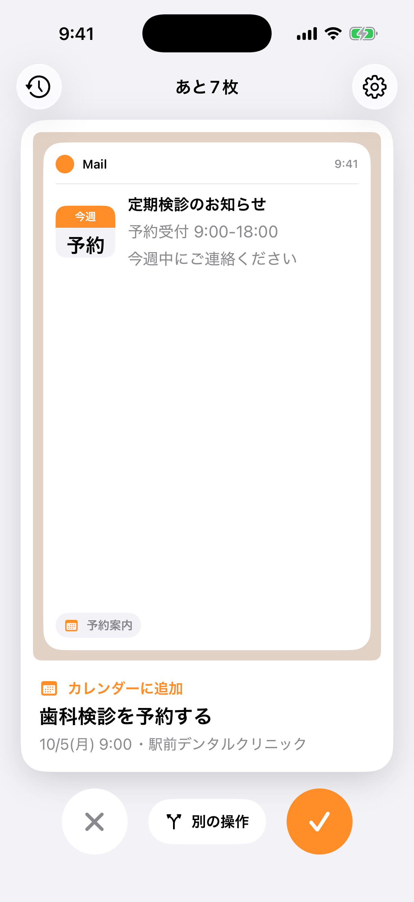
*Atodeのホーム画面です。スクショ1枚ごとにカードが出て、AIの提案（ここでは「カレンダーに追加」）が下に表示されます。*

## 3分でわかる要点

:::message
- iOSアプリ「Atode」に、TypeSafe社の新しいAI **Jev**（System One）を組み込みました。
- Atodeは、スクショをAIが読み取り、「カレンダーに追加」「買い物リストに追加」などの**次の行動を提案する**アプリです。
- AIを2つ使い分けています。**Gemini** が「文章を書く・情報を抜き出す」係、**Jev** が「どれに当てはまるかを判定する」係です。
- 2つのAIは**同時に（並列で）**呼びます。本番で測ったJevの応答時間は **222ms と 244ms** でした。関数全体の2.6〜3.2秒の中に収まるため、待ち時間は増えていません。
- Jevの答えは、**しきい値**（「この数値以上なら採用する」という線）を超えたときだけ採用します。Jevが失敗しても、Geminiの結果だけでそのまま動きます。
- 記事の最後に、組み込むときの**チェックリスト**と、**用語集**を置いています。
:::

---

## はじめに

### この記事で分かること

- Jevとはどんな AI で、ふつうの大規模言語モデル（LLM）と何が違うのか
- Jevへの「質問」の作り方（`choice`・`score`・`noul` の使い分け）
- Cloud Functions（TypeScript）での実装：リクエストの組み立て、応答の解析、タイムアウト、失敗したときの扱い
- GeminiとJevの結果を、数値のしきい値で合わせる方法（計算例つき）
- 判定結果が、iOSアプリの画面（スワイプ・取り消し・ポップアップ）にどうつながるか
- 本番での確かめ方（ログ、応答時間、App Check、1日の上限）

### 対象の読者と、読み方の近道

この記事は、3種類の読者を想定しています。全部を読まなくても大丈夫です。

| あなたは… | おすすめの読み方 |
| --- | --- |
| プログラミングを始めたばかり／AIアプリに興味がある | 「Atodeとは」「Jevとは何か」「全体の構成」の図、「判定が画面になるまで」を読む。折りたたまれた「**深掘り**」は開かなくても話がつながります |
| 自分のアプリにJevを組み込みたいエンジニア | 「Jevへの質問を設計する」「実装」「ハマった点」「チェックリスト」を中心に |
| 「AIでスクショがどう整理されるの？」が気になる | 「Atodeとは」「判定が画面になるまで」「背面タップと共有シート」、最後の「Atodeの紹介」 |

:::message
**初めて見る言葉が出てきたら**、記事の最後の[用語集](#用語集)を見てください。本文でも、初めて出てきたときに、たとえ話で短く説明します。
:::

:::message
この記事で紹介する画面（スワイプで振り分ける画面、履歴、背面タップや共有シートのポップアップ）は、**Atode 2.1.0** の機能です。2026年10月2日の時点では、App Storeで配信されているのは2.0.0で、2.1.0は審査中です。
:::

---

## Atodeとは：撮ったスクショが「次の行動」になる

### どんな困りごとを解決するのか

イベントの告知、買い物メモ、気になるお店、あとで読みたい記事。「あとで見よう」とスクショを撮ったのに、そのまま写真アプリの奥に埋もれてしまうことはありませんか。

Atodeは、撮ったスクショをAIが読み取り、**次にやること**を提案するアプリです。

- イベントの告知なら「カレンダーに追加」
- 買い物メモなら「買い物リストに追加」
- お店の情報なら「行きたい場所に追加」

提案が合っていれば**右にスワイプ**するだけで、Apple純正のカレンダーやリマインダーに登録されます。いらなければ左にスワイプ、違っていれば「別の操作」から選び直します。

### 処理の前後を見比べる

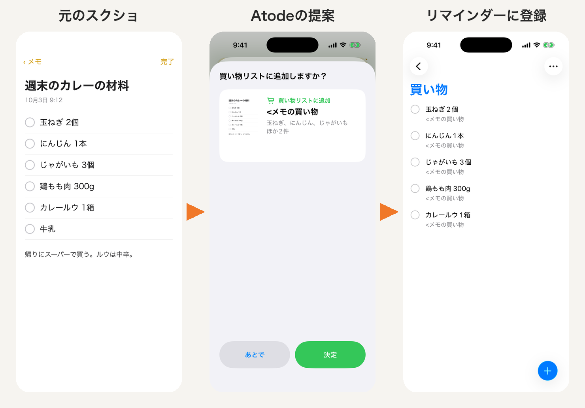
*左：元のスクショ（カレーの材料のメモ）。中央：Atodeの提案「買い物リストに追加しますか？」。右：決定すると、純正リマインダーの「買い物」リストに品目ごとに登録されます。*

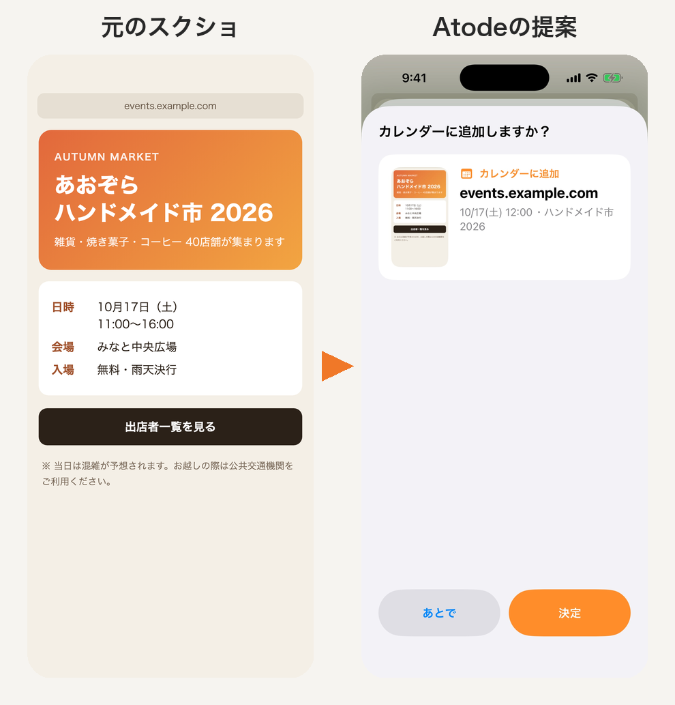
*左：イベント告知のスクショ。右：Atodeの提案「カレンダーに追加しますか？」。*

:::message alert
**この2枚について正直に書いておきます。** 上の比較は、iOSシミュレーター（Mac上で動く仮想のiPhone）で撮りました。シミュレーターではサーバーのAIを呼ぶための証明（後で説明する App Check）が取れないため、**端末内の簡易な解析**に切り替わっています。そのため、イベントのタイトルがURLになり、時刻も11:00ではなく12:00になっています。買い物メモでも「牛乳」が抜けています。

本番では、ここにGeminiとJevの判定が入ります。「AIが使えないときでも、最低限の提案は出す」という作りの実例として見てください。
:::

元のスクショ2枚は、記事のために作った架空のものです（実在のイベントやお店ではありません）。

---

## Jevとは何か、なぜ使ったか

### 一言でいうと「マークシートで答えるAI」

ChatGPTやGeminiのような**大規模言語モデル（LLM）**は、文章を読んで、文章で答えるAIです。とても賢い反面、「このスクショはカレンダー向き？」と聞くと、「はい、おそらくカレンダーに登録するのがよいでしょう。理由は…」のように、**答え方が毎回少しずつ変わります**。

Jevは、TypeSafe社の **System One** というAPIで使えるモデルです。こちらは答え方が**最初から決まっています**。

:::message
**たとえ話**

- LLMは「作文が得意な人」です。何を聞いても、自分の言葉で文章を書いて答えてくれます。
- Jevは「マークシートで答える審判」です。「A〜Fのどれ？」「1〜3の何段階？」「はい／いいえ？」と聞くと、**決まった欄に、決まった形で**答えを書きます。しかも「どれくらい自信があるか」を数字で添えてくれます。
:::

### Jevの3種類の質問

Jevには、次の3種類の質問ができます（公式ドキュメント： [TypeSafe API](https://docs.typesafe.ai/api.md)）。

| 種類 | 何を聞くか | 返ってくるもの |
| --- | --- | --- |
| `choice` | 選択肢から1つ選ぶ（最大255個） | 選んだ答え `choice`、各選択肢の確率 `probabilities`、確信度 `confidence` |
| `score` | 段階で評価する（低い〜高い など） | 確率で重み付けした値 `score`、段階の一覧 `legend`、確信度 `confidence` など |
| `noul` | はい／いいえで答える | 「はい」の確率 `noul`（0〜1） |

**確率**とは、「どれくらいありそうか」を0から1の数字で表したものです。0.93なら「93%くらいの確かさで、はい」という意味です。

### LLMに判定まで任せた場合との比較

Atodeでは、Jevを入れる前もGeminiに「カテゴリ」「優先度」「どの行動を提案するか」をまとめて答えさせていました。答えは **JSON**（プログラムが読みやすい、データを書くための決まった書式）で返させ、その形は **スキーマ**（「この項目は数字、この項目は文字」といったデータの形の決まり）で指定しています。Geminiの出力には、行動ごとに `confidence`（自信の度合い）という数字も入れさせています。ただ、この数字は**LLM自身が文章の一部として書いた数字**です。

| | LLMに判定まで任せる | Jevに判定を任せる |
| --- | --- | --- |
| 答えの形 | JSONの形はスキーマで縛れるが、中身の数字はLLMの自己申告 | 種類ごとに形が決まっている |
| 自信の数字 | LLMが文章の一部として自分で書く数字 | 選択肢ごとの確率として返る |
| 選択肢の外の答え | カテゴリ名などを自由に作れる（作ってしまう） | 用意した選択肢からしか選ばない |
| 文章の生成 | できる | **できない** |
| 画像の入力 | できる | **できない**（テキストだけ） |

Jevは文章を書けず、画像も読めません。そこで、Atodeでは**役割を分けました**。

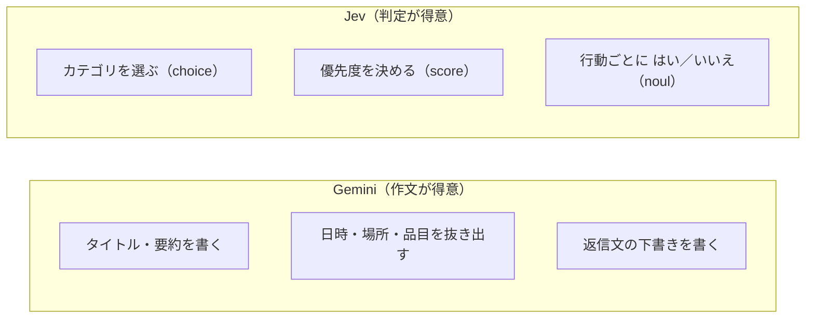
```mermaid
flowchart LR
  subgraph G["Gemini（作文が得意）"]
    G1["タイトル・要約を書く"]
    G2["日時・場所・品目を抜き出す"]
    G3["返信文の下書きを書く"]
  end
  subgraph J["Jev（判定が得意）"]
    J1["カテゴリを選ぶ（choice）"]
    J2["優先度を決める（score）"]
    J3["行動ごとに はい／いいえ（noul）"]
  end
```

:::message
Jevの料金や、内部でどのように確率を計算しているかは、この記事では扱いません。コードから確かめられないためです。詳しくは[公式ドキュメント](https://docs.typesafe.ai/api.md)を参照してください。
:::

---

## 全体の構成

### 登場人物

- **iOSアプリ（Atode）**：スクショの文字を端末の中で読み取り、サーバーに送ります。画像から文字を読み取る技術を **OCR** といいます。
- **Cloud Functions**：Googleのサーバーで、呼ばれたときだけ動くプログラムです。たとえるなら「呼び鈴を押されたときだけ出てくる受付係」です。Atodeでは Cloud Functions v2（Node.js 22 / TypeScript）を使っています。
- **Gemini**（`gemini-3.1-flash-lite`）：Googleの LLM です。
- **Jev**（`jev-latest`）：TypeSafe の判定モデルです。

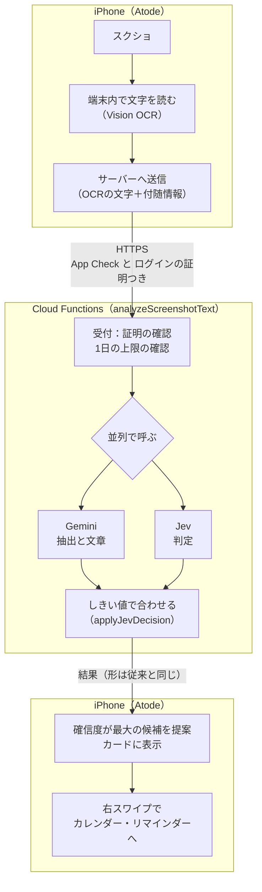
```mermaid
flowchart TB
  subgraph iPhone["iPhone（Atode）"]
    A1["スクショ"] --> A2["端末内で文字を読む<br/>（Vision OCR）"]
    A2 --> A3["サーバーへ送信<br/>（OCRの文字＋付随情報）"]
  end
  A3 -->|"HTTPS<br/>App Check と ログインの証明つき"| F
  subgraph Cloud["Cloud Functions（analyzeScreenshotText）"]
    F["受付：証明の確認<br/>1日の上限の確認"] --> P{"並列で呼ぶ"}
    P --> GM["Gemini<br/>抽出と文章"]
    P --> JV["Jev<br/>判定"]
    GM --> M["しきい値で合わせる<br/>（applyJevDecision）"]
    JV --> M
  end
  M -->|"結果（形は従来と同じ）"| R
  subgraph iPhone2["iPhone（Atode）"]
    R["確信度が最大の候補を提案<br/>カードに表示"] --> S["右スワイプで<br/>カレンダー・リマインダーへ"]
  end
```

:::message
**送るデータについて**

サーバーへ送るのは、基本的に**OCRで読み取った文字**と、撮った日時などの付随情報です。画像そのものは、ユーザーが許可した場合にだけGeminiへ送ります。**Jevには画像を一切送りません**（Jevはテキストしか受け付けないためでもあります）。
:::

### 1枚のスクショが処理される流れ

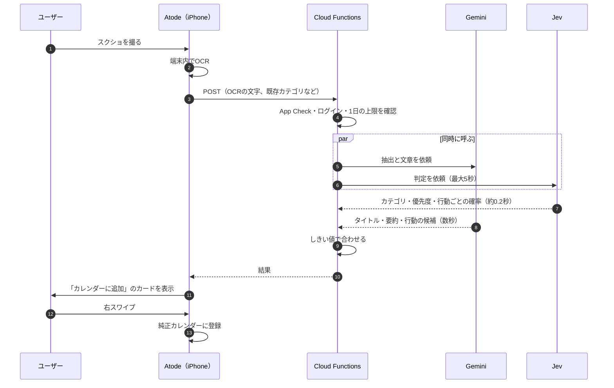
```mermaid
sequenceDiagram
  autonumber
  participant U as ユーザー
  participant App as Atode（iPhone）
  participant F as Cloud Functions
  participant G as Gemini
  participant J as Jev
  U->>App: スクショを撮る
  App->>App: 端末内でOCR
  App->>F: POST（OCRの文字、既存カテゴリなど）
  F->>F: App Check・ログイン・1日の上限を確認
  par 同時に呼ぶ
    F->>G: 抽出と文章を依頼
    F->>J: 判定を依頼（最大5秒）
  end
  J-->>F: カテゴリ・優先度・行動ごとの確率（約0.2秒）
  G-->>F: タイトル・要約・行動の候補（数秒）
  F->>F: しきい値で合わせる
  F-->>App: 結果
  App->>U: 「カレンダーに追加」のカードを表示
  U->>App: 右スワイプ
  App->>App: 純正カレンダーに登録
```

---

## Jevへの「質問」を設計する

組み込みで一番時間をかけたのは、コードよりも**Jevに何をどう聞くか**でした。この節では、その設計を説明します。

### 何を聞くのか

Atodeでは、1枚のスクショにつき、**9個の質問**をまとめて1回で送ります。

| 質問のID | 種類 | 内容 |
| --- | --- | --- |
| `category` | `choice` | このスクショを整理するカテゴリはどれか |
| `priority` | `score` | 対応の緊急度はどの程度か（low / normal / high） |
| `kind_calendar` | `noul` | カレンダーに登録すべき予定があるか |
| `kind_reminder` | `noul` | リマインダーに登録すべきタスクがあるか |
| `kind_wishlist` | `noul` | 購入を検討している商品があるか |
| `kind_shoppingList` | `noul` | 買い物リストにすべき品目があるか |
| `kind_place` | `noul` | 行きたい場所として保存すべき店や施設があるか |
| `kind_reply` | `noul` | 返信が必要なメッセージがあるか |
| `kind_read` | `noul` | あとで読むべき記事があるか |

### なぜこう聞くのか

**1. 行動は「どれか1つ選んで」ではなく、行動ごとに「はい／いいえ」で聞く**

1枚のスクショに、複数の行動が含まれることがあります。たとえば「10/12 19:00 渋谷で打ち合わせ。帰りに牛乳と卵を買う」なら、「予定」と「買い物」の両方が正解です。`choice` で1つだけ選ばせると、もう片方が消えてしまいます。そこで、行動の種類ごとに独立した `noul` で聞いています。

**2. 「保管（keep）」については聞かない**

Atodeには「保管する（履歴にだけ残す）」という行動もあります。これは「ほかの行動が当てはまらないときの受け皿」なので、Jevの判定の対象から外しました。

**3. カテゴリの選択肢には、ユーザーが作ったカテゴリも入れる。最後に「どれでもない」を置く**

ユーザーが使っているカテゴリと、Atodeの既定のカテゴリを合わせて選択肢にします。最後には必ず `__other__`（どれでもない）を置きます。これがないと、当てはまるものがなくても、Jevは無理にどれかを選ぶしかありません。

**4. 文字が少なすぎるときは聞かない**

空白を除いて12文字未満のときは、Jevを呼びません。判断の材料がないのに呼んでも、意味のある答えは返ってこないためです。

### 実際に送るJSON

テストで使っている入力（「10/12 19:00 渋谷で打ち合わせ。帰りに牛乳と卵を買う」）から作られるリクエストは、次のような形です（長いので一部を省略しています）。

```json
{
  "model": "jev-latest",
  "state": {
    "ocrText": "10/12 19:00 渋谷で打ち合わせ。帰りに牛乳と卵を買う",
    "sourceType": "screenshot",
    "sourceURL": null,
    "userMemo": null,
    "capturedAt": null,
    "currentDate": "2026-10-02T09:00:00+09:00",
    "timezone": "Asia/Tokyo"
  },
  "questions": {
    "category": {
      "type": "choice",
      "instructions": "このスクショを整理するカテゴリとして最も適切なものはどれですか？",
      "criteria": {
        "仕事": "ユーザーが作成したカテゴリ「仕事」に当てはまる内容",
        "予定・期限": "日時のある予定、締切、支払い期限",
        "…": "…",
        "__other__": "上のどのカテゴリにも当てはまらない"
      }
    },
    "priority": {
      "type": "score",
      "instructions": "ユーザーがこのスクショの内容に対応する緊急度はどの程度ですか？",
      "criteria": [
        "low: 急ぎではなく、気が向いたときに確認すればよい",
        "normal: 数日〜数週間のうちに確認・対応したい",
        "high: 今日〜数日以内の期限や予定があり、早めの対応が必要"
      ]
    },
    "kind_calendar": {
      "type": "noul",
      "instructions": "日時が決まった予定・イベント・予約として、カレンダーに登録すべき内容が含まれていますか？",
      "criteria": {
        "true": "開催日時のある予定、イベント、予約、集まりがある",
        "false": "カレンダーに入れる具体的な予定はない"
      }
    }
  }
}
```

`state` は「判断の材料」、`questions` は「聞きたいこと」です。`criteria` には、各答えが何を意味するのかを、言葉で書いておきます。`currentDate`（今日の日付）を渡しているのは、「今日〜数日以内」のような優先度の判断に使ってもらうためです。

---

## 実装

ここからはコードです。抜粋は、Atodeの非公開リポジトリから引用しています。一部を省略した箇所は、コメントで示しています。秘密の値は含まれていません。

### 1. Jevへのリクエストを組み立てる

**何をするのか**：上の表の9個の質問を、プログラムで作ります。

**なぜそうするのか**：カテゴリはユーザーごとに違い、行動の種類はアプリの更新で増えることがあります。手書きのJSONではなく、型の定義から作るようにしました。

```ts:functions/src/jevClient.ts
export function buildJevRequest(request: AnalyzeScreenshotTextRequest): JevRequest {
  const questions: Record<string, JevQuestion> = {
    category: {
      type: "choice",
      instructions: "このスクショを整理するカテゴリとして最も適切なものはどれですか？",
      criteria: categoryCriteria(request.existingCategories ?? []),
    },
    priority: {
      type: "score",
      instructions: "ユーザーがこのスクショの内容に対応する緊急度はどの程度ですか？",
      criteria: priorityLevels,
    },
  };
```

- `category` は `choice`（選択式）の質問です。選択肢は `categoryCriteria` という関数で作ります（後述）。
- `priority` は `score`（段階評価）の質問です。`priorityLevels` には low / normal / high の3段階の説明が入っています。

```ts:functions/src/jevClient.ts
  for (const kind of JUDGED_ACTION_KINDS) {
    const question = kindQuestions[kind];
    questions[kindQuestionId(kind)] = {
      type: "noul",
      instructions: question.instructions,
      criteria: {true: question.true, false: question.false},
    };
  }
```

- `JUDGED_ACTION_KINDS` は、行動の種類から `keep`（保管）だけを除いた一覧です。
- 種類ごとに `kind_calendar` のようなIDを付けて、`noul`（はい／いいえ）の質問を作ります。

`JUDGED_ACTION_KINDS` は、次のように型ごと絞り込んでいます。

```ts:functions/src/jevClient.ts
export type JudgedActionKind = Exclude<ActionKind, "keep">;

export const JUDGED_ACTION_KINDS = ACTION_KINDS.filter(
  (kind): kind is JudgedActionKind => kind !== "keep"
);
```

- `Exclude<ActionKind, "keep">` は、「行動の種類から keep を除いた型」です。
- こうしておくと、アプリに行動の種類が増えたとき、`kindQuestions`（質問文の表）に書き忘れるとコンパイルエラーになります。

カテゴリの選択肢は、次の関数で作ります。

```ts:functions/src/jevClient.ts
function categoryCriteria(existingCategories: string[]): Record<string, string> {
  const names = [...existingCategories, ...Object.keys(defaultCategories)]
    .map((name) => name.trim())
    .filter((name) => name && name.length <= maxCategoryLength && name !== OTHER_CATEGORY);
  const criteria: Record<string, string> = {};
  for (const name of [...new Set(names)].slice(0, maxChoiceOptions - 1)) {
    criteria[name] = defaultCategories[name] ?? `ユーザーが作成したカテゴリ「${name}」に当てはまる内容`;
  }
  criteria[OTHER_CATEGORY] = "上のどのカテゴリにも当てはまらない";
  return criteria;
}
```

- 1行目：ユーザーのカテゴリと、既定のカテゴリ（買いたいもの・予定・期限など6個）をつなげます。
- `.map` と `.filter`：前後の空白を削り、空の名前、40文字を超える名前、`__other__` と同じ名前を除きます。
- `new Set(names)`：重複を除きます（ユーザーが「予定・期限」を使っていても、1つにまとまります）。
- `.slice(0, maxChoiceOptions - 1)`：`maxChoiceOptions` は255です。Jevの `choice` は**最大255個**なので、最後の `__other__` の分を1つ空けて、254個までにします。
- 最後に `__other__` を必ず追加します。

### 2. Jevを呼ぶ（タイムアウトつき）

**何をするのか**：組み立てたリクエストを、JevのAPIに送ります。

```ts:functions/src/jevClient.ts
    const response = await fetch(jevEndpoint, {
      method: "POST",
      headers: {"Content-Type": "application/json", "Authorization": `Bearer ${apiKey}`},
      body: JSON.stringify(jevRequest),
      signal: AbortSignal.timeout(jevTimeoutMs),
    });
```

- `jevEndpoint` は `https://api.typesafe.ai/v1/systemone` です。
- `Authorization: Bearer …` は**Bearer認証**です。APIキーを「この鍵を持っている人です」と見せて通してもらう方式で、たとえるなら会員証を提示して入館するイメージです。
- `AbortSignal.timeout(jevTimeoutMs)`：`jevTimeoutMs` は5000（5秒）です。5秒たっても返事がなければ、通信を打ち切ります。

:::message
**タイムアウトとは**

「この時間までに返事がなければ、待つのをやめる」という決まりです。電話で5回コールしても出なければ、いったん切るのと同じです。いつまでも待ち続けると、アプリの画面も止まってしまいます。
:::

APIキーは、コードに直接書かず、Firebaseの**シークレット**（秘密の値を保管する場所）から読み込みます。

```ts:functions/src/jevClient.ts
export const jevApiKey = defineSecret("JEV_API_KEY");
```

```ts:functions/src/jevClient.ts
function getJevApiKey(): string | undefined {
  if (process.env.JEV_API_KEY) {
    return process.env.JEV_API_KEY === localDisabledApiKey ?
      undefined : process.env.JEV_API_KEY;
  }
  try {
    const key = jevApiKey.value();
    return key && key !== localDisabledApiKey ? key : undefined;
  } catch {
    return undefined;
  }
}
```

- まず環境変数を見ます。ローカルのテストやエミュレーターではこちらを使います。
- 値が `local-dev-disabled` のときは「キーがない」扱いにします。開発中にJevを呼ばないための仕組みです。
- 本番では `jevApiKey.value()` でシークレットから読みます。読めなければ `undefined` を返し、Jevを使わずに進みます。

### 3. 失敗しても止まらない仕組み

**何をするのか**：Jevで何が起きても、`null`（判定なし）を返すだけにします。

**なぜそうするのか**：Jevは「あれば精度が上がる」部品で、なくてもアプリは動きます。Jevの不調でスクショの解析ごと失敗させるのは、割に合いません。

```ts:functions/src/jevClient.ts
    if (!response.ok) {
      logger.warn("Jev judgement failed.", {
        status: response.status,
        latencyMs: Date.now() - startedAt,
        ...(response.status === 422 ? {detail: (await response.text()).slice(0, 300)} : {}),
      });
      return null;
    }
```

- `response.ok` が false（HTTPのステータスが200番台でない）なら、ログを残して `null` を返します。**HTTPのステータス**は通信の結果を表す番号で、200番台は成功、400番台・500番台は失敗を意味します。
- **422**（リクエストの中身が不正）のときだけ、エラーの中身を300文字までログに残します。質問の書き方を間違えたときに、原因をすぐ見つけるためです。
- 429（回数制限）や 529（混雑）のときは、ステータスだけを残します。

```ts:functions/src/jevClient.ts
  } catch (error) {
    logger.warn("Jev judgement failed.", {
      latencyMs: Date.now() - startedAt,
      error: error instanceof Error ? error.name : String(error),
    });
    return null;
  }
```

- タイムアウトや通信エラーは、**例外**（エラーが起きたことを知らせる仕組み。`throw` で投げられ、`catch` で受け止める）として飛んできます。ここで受け止めて、やはり `null` を返します。
- ログに残すのは `error.name`（`TimeoutError` など）だけです。エラーの本文には、リクエストの中身が含まれる場合があるためです。

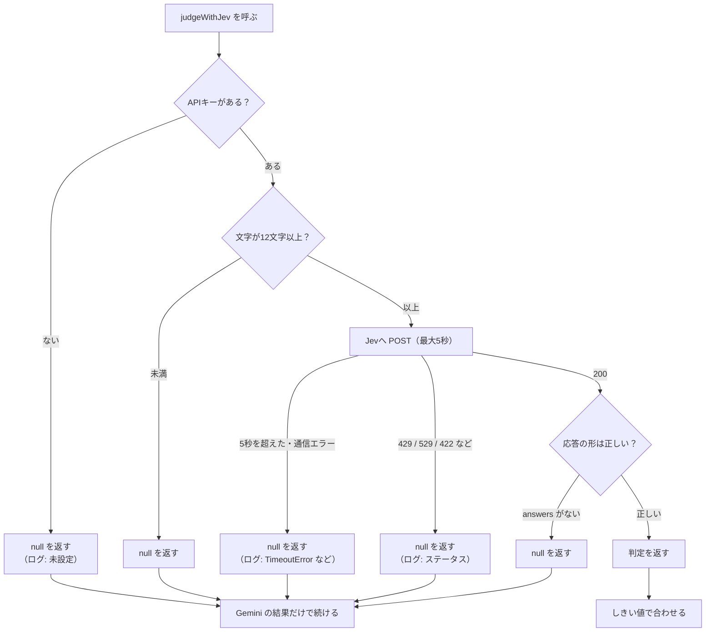
```mermaid
flowchart TD
  S["judgeWithJev を呼ぶ"] --> K{"APIキーがある？"}
  K -->|ない| N1["null を返す<br/>（ログ: 未設定）"]
  K -->|ある| T{"文字が12文字以上？"}
  T -->|未満| N2["null を返す"]
  T -->|以上| C["Jevへ POST（最大5秒）"]
  C -->|5秒を超えた・通信エラー| N3["null を返す<br/>（ログ: TimeoutError など）"]
  C -->|"429 / 529 / 422 など"| N4["null を返す<br/>（ログ: ステータス）"]
  C -->|200| P{"応答の形は正しい？"}
  P -->|"answers がない"| N5["null を返す"]
  P -->|正しい| D["判定を返す"]
  N1 & N2 & N3 & N4 & N5 --> G["Gemini の結果だけで続ける"]
  D --> M["しきい値で合わせる"]
```

### 4. 応答を解析する

**何をするのか**：Jevの答えを、アプリで使う形に変えます。

**なぜ丁寧にやるのか**：外部APIの答えは、いつも期待どおりとは限りません。数字の代わりに文字が入っていたり、確率が1を超えていたりしても、アプリが壊れないようにします。

まず、テストで使っているJevの応答の例です（実際の応答と同じ形です）。

```json
{
  "model": "jev-1.13.0",
  "answers": {
    "category": {"type": "choice", "choice": "予定・期限", "probabilities": {"予定・期限": 0.82}, "confidence": 0.82},
    "priority": {"type": "score", "score": 1.8, "legend": {"0": "low", "1": "normal", "2": "high"}, "confidence": 0.7},
    "kind_calendar": {"type": "noul", "noul": 0.93},
    "kind_reminder": {"type": "noul", "noul": 0.4},
    "kind_wishlist": {"type": "noul", "noul": 0.03},
    "kind_shoppingList": {"type": "noul", "noul": 0.88},
    "kind_place": {"type": "noul", "noul": 0.1},
    "kind_reply": {"type": "noul", "noul": 0.02},
    "kind_read": {"type": "noul", "noul": 0.05}
  },
  "usage": {"input_tokens": 420, "output_tokens": 18}
}
```

`model` が `jev-latest` ではなく `jev-1.13.0` になっている点に注目してください。リクエストでは「最新版」を指定し、実際に使われた版が応答で返ってきます。

行動の確率は、次のように取り出します。

```ts:functions/src/jevClient.ts
  for (const kind of JUDGED_ACTION_KINDS) {
    const answer = asRecord(answers[kindQuestionId(kind)]);
    if (answer.type === "noul" && isProbability(answer.noul)) {
      kindProbabilities[kind] = answer.noul;
    }
  }
```

- `asRecord`：中身がオブジェクトでなければ、空のオブジェクトとして扱う小さな関数です。
- `isProbability`：数字で、かつ0以上1以下のときだけ true になります。
- 条件に合わない答えは**黙って捨てます**。捨てた種類は、後の合わせる処理で「Jevの意見なし」として扱われます。

カテゴリは、**送った選択肢の中にある答えだけ**を受け取ります。

```ts:functions/src/jevClient.ts
function parseChoice(value: unknown, options: string[]): JevDecision["category"] {
  const answer = asRecord(value);
  if (answer.type !== "choice" || typeof answer.choice !== "string" || !options.includes(answer.choice)) {
    return null;
  }
  const confidence = isProbability(answer.confidence) ?
    answer.confidence : asRecord(answer.probabilities)[answer.choice];
  return isProbability(confidence) ? {value: answer.choice, confidence} : null;
}
```

- `!options.includes(answer.choice)`：送っていないカテゴリ名が返ってきたら無視します。
- 確信度は `confidence` を使い、なければ `probabilities` の中の、選ばれた答えの確率を使います。

:::details 深掘り：優先度の score を low / normal / high に変換する
`score` は「各段階の確率で重み付けした値」です。そのため、1.8 のように段階と段階の間の値になります。また、段階の番号が0から始まるのか1から始まるのかは、応答の `legend`（段階の一覧）を見ないと分かりません。

```ts:functions/src/jevClient.ts
function parsePriority(value: unknown): JevDecision["priority"] {
  const answer = asRecord(value);
  if (answer.type !== "score" || typeof answer.score !== "number" || !Number.isFinite(answer.score) ||
      !isProbability(answer.confidence)) {
    return null;
  }
  const [min, max] = scoreRange(answer.legend);
  const ratio = max > min ? (answer.score - min) / (max - min) : 0;
  const index = Math.min(PRIORITIES.length - 1, Math.max(0, Math.round(ratio * (PRIORITIES.length - 1))));
  return {value: PRIORITIES[index], confidence: answer.confidence};
}
```

- `scoreRange(answer.legend)`：`legend` のキー（"0"〜"2" など）から、最小と最大を求めます。`legend` が読めなければ、0〜2とみなします。
- `ratio`：score が範囲のどこにあるかを、0〜1の割合にします。
- `Math.round(ratio * 2)`：割合を 0・1・2 のどれかに丸め、`["low", "normal", "high"]` から選びます。

**計算例**

| legend | score | ratio | ratio × 2 | 丸め | 結果 |
| --- | --- | --- | --- | --- | --- |
| "0"〜"2"（0始まり） | 1.8 | (1.8−0)/(2−0) = 0.9 | 1.8 | 2 | **high** |
| "1"〜"3"（1始まり） | 2 | (2−1)/(3−1) = 0.5 | 1.0 | 1 | **normal** |

本物のAPIで確かめたところ、`legend` は0始まり（"0"〜"2"）でした。それでも1始まりのケースにも対応し、テストも用意しています。
:::

### 5. GeminiとJevを並列に呼ぶ

**何をするのか**：GeminiとJevを、同時に呼び出します。

**なぜそうするのか**：順番に呼ぶと、待ち時間が「Geminiの時間＋Jevの時間」になります。同時に呼べば「長いほうの時間」だけで済みます。Jevは約0.2秒、Geminiは数秒かかるので、Jevの分の待ち時間は実質ゼロになります。

```ts:functions/src/index.ts
    // Jev runs in parallel with Gemini and never rejects; a null decision leaves the result untouched.
    const jevDecision = enableJev.value() ? judgeWithJev(parsedRequest.value) : Promise.resolve(null);
    let result: AnalyzeScreenshotTextResponse;
    try {
      result = await analyzeWithRetry(parsedRequest.value);
    } catch (error) {
      // （ログを残す処理は省略）
      result = analyzeLocally(parsedRequest.value);
    }
    response.status(200).json({
      ...applyJevDecision(result, await jevDecision),
      usage: quotaUsageResponse(quota),
    });
```

- 1行目：`judgeWithJev(...)` を呼びますが、**`await` を付けていません**。これで「Jevへの問い合わせを始めて、答えを待たずに次へ進む」動きになります。答えは `jevDecision` という「あとで届く箱」（Promise）に入ります。
- `await analyzeWithRetry(...)`：その間にGeminiを呼び、答えを待ちます。Geminiの応答がスキーマに合わなかったときは、1回だけやり直します。
- `catch` の中：Geminiが失敗したら、サーバーの中の**ルールベースの解析**（`analyzeLocally`）に切り替えます。
- `await jevDecision`：最後に、Jevの答えを箱から取り出します。Geminiより先に終わっているので、ここではほぼ待ちません。

:::message
**`judgeWithJev` は決して例外を投げない**ように作っています（失敗はすべて `null` を返す）。そのため、`await jevDecision` で処理が止まることはありません。もし例外を投げる作りにすると、Geminiが成功していても、Jevの失敗で全体が500エラーになってしまいます。
:::

Jevの待ち時間は、Geminiの待ち時間の中に隠れます。実際の数字は、後の「本番での運用」で紹介します。

### 6. しきい値で結果を合わせる

**何をするのか**：Geminiの結果の一部を、Jevの判定で置き換えます。

**なぜしきい値を使うのか**：Jevも間違えることがあります。自信がないときの答えまで採用すると、かえって精度が下がります。そこで「この数値以上なら採用する」という線、つまり**しきい値**を決めました。

| 項目 | しきい値 | 採用するときの動き |
| --- | --- | --- |
| カテゴリ | 確信度 **0.6以上**、かつ `__other__` 以外 | Geminiのカテゴリを置き換える |
| 優先度 | 確信度 **0.5以上** | Geminiの優先度を置き換える |
| 行動 | 確率 **0.2未満**は除外 | 残った行動の `confidence` を、Jevの確率に置き換える |

```ts:functions/src/jevMerge.ts
const categoryMinConfidence = 0.6;
const priorityMinConfidence = 0.5;
const actionDropProbability = 0.2;
```

行動の合わせ方は、次の数行です。

```ts:functions/src/jevMerge.ts
      actions: result.actions.flatMap((action) => {
        const probability = action.kind === "keep" ? undefined : decision.kindProbabilities[action.kind];
        if (probability === undefined) return [action];
        if (probability < actionDropProbability) return [];
        return [{...action, confidence: probability}];
      }),
```

- `flatMap` は、「1つの要素を、0個または1個以上の要素に変える」ための関数です。`[]` を返すと、その行動は消えます。
- `keep`（保管）と、Jevの意見がない種類は、**そのまま残します**（`return [action]`）。
- 確率が0.2未満なら**消します**（`return []`）。
- それ以外は、`confidence` を**Jevの確率に置き換えます**。

カテゴリと優先度は、置き換えるかどうかを、それぞれ1つの関数で決めています。

```ts:functions/src/jevMerge.ts
function acceptedCategory(decision: JevDecision): string | null {
  const category = decision.category;
  if (!category || category.value === OTHER_CATEGORY || category.confidence < categoryMinConfidence) {
    return null;
  }
  return category.value;
}
```

- Jevが「どれでもない（`__other__`）」を選んだときは、どんなに自信があっても置き換えません。Geminiが自由に考えたカテゴリのほうが役に立つためです。

#### 数値の例で計算してみる

テストと同じ数字で、実際に計算してみます。スクショは「10/12 19:00 渋谷で打ち合わせ。帰りに牛乳と卵を買う」です。

| 行動 | Geminiの confidence | Jevの確率 | 判定 | 合わせた後 |
| --- | --- | --- | --- | --- |
| カレンダー | 0.5 | 0.93 | 0.2以上 → 置き換え | **0.93** |
| ほしいもの | 0.6 | 0.03 | 0.2未満 → **除外** | （消える） |
| 保管（keep） | 0.5 | （聞いていない） | そのまま | 0.5 |
| 買い物リスト | 0.7 | 0.88 | 0.2以上 → 置き換え | **0.88** |
| 返信 | 0.6 | （このテストでは答えなし） | そのまま | 0.6 |

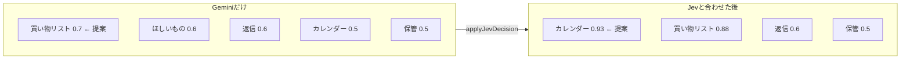
```mermaid
flowchart LR
  subgraph Before["Geminiだけ"]
    b1["買い物リスト 0.7 ← 提案"]
    b2["ほしいもの 0.6"]
    b3["返信 0.6"]
    b4["カレンダー 0.5"]
    b5["保管 0.5"]
  end
  subgraph After["Jevと合わせた後"]
    a1["カレンダー 0.93 ← 提案"]
    a2["買い物リスト 0.88"]
    a3["返信 0.6"]
    a4["保管 0.5"]
  end
  Before -->|"applyJevDecision"| After
```

Geminiだけのときは「買い物リスト（0.7）」が一番上でした。合わせた後は「カレンダー（0.93）」が一番上になり、**アプリが最初に提案する行動が変わります**。「ほしいもの」は、そもそも買いたい商品がないので消えました。

カテゴリと優先度は、次のようになります。

- カテゴリ：Jevは「予定・期限」を確信度0.82で選びました。0.6以上なので、Geminiの「未整理」を置き換えます。
- 優先度：Jevは high を確信度0.7で返しました。0.5以上なので、Geminiの normal を置き換えます。

:::details 深掘り：しきい値の数字をどう決めたか
しきい値は、次の考え方で決めました。

- **カテゴリ（0.6）**：カテゴリは選択肢が多く、ユーザーが作った名前も混ざります。外れたときに目立つので、少し高めにしました。
- **優先度（0.5）**：3段階しかなく、外れても大きな害がないため、カテゴリより低くしました。
- **行動の除外（0.2）**：「消す」のは強い操作です。Jevが「ほぼ確実に違う」と言うときだけ消し、迷っている行動は残して、ユーザーが「別の操作」から選べるようにしました。

どれも、本番のデータで最適化した値ではありません。運用しながら見直す前提の、最初の値です。
:::

### 7. 機能フラグで段階的に有効にする

**何をするのか**：Jevを使うかどうかを、コードを変えずに切り替えられるようにします。

**機能フラグ**とは、機能の電源スイッチのようなものです。コードには機能を入れておき、スイッチがONのときだけ動かします。

```ts:functions/src/index.ts
const enableJev = defineBoolean("ATODE_ENABLE_JEV", {
  default: false,
  description: "Use TypeSafe Jev to judge category, priority and action kinds alongside Gemini.",
});
```

- `defineBoolean` は、Firebaseのパラメータ（デプロイ時に決める設定値）を定義する関数です。
- 既定値は `false`（OFF）です。

有効にする手順は、次の3つです。

1. シークレットにAPIキーを登録する：`firebase functions:secrets:set JEV_API_KEY`
2. `functions/.env.<プロジェクトID>` に `ATODE_ENABLE_JEV=true` と書く
3. デプロイする

:::message
**レスポンスの形を変えなかった**のが、この組み込みの大事なポイントです。Jevは、Geminiの結果の中の「数字や選択」を書き換えるだけです。新しい項目は追加していません。そのため、**iOSアプリは1行も変えずに**、サーバーのスイッチだけでJevを入れたり外したりできます。App Storeの審査を待たずに試せて、問題があればすぐに戻せます。
:::

### 8. テストの書き方

テストには、Node.js に標準で入っている `node:test` を使いました。外部のテスト用ライブラリは入れていません。テストは4つのグループ、14件です。

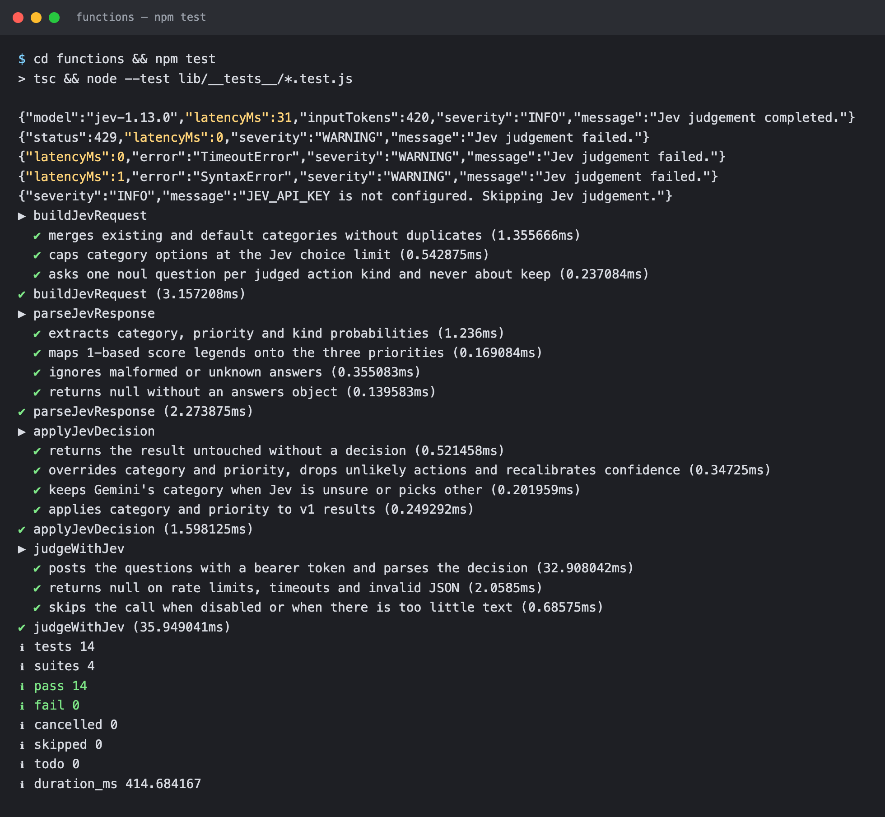
*`cd functions && npm test` の結果です。14件すべてが通っています（ターミナルの出力を、読みやすいように画像にしたものです）。上の JSON の行は、テストの中で動いたログです。*

いちばん大事なのは、**本物のJevを呼ばずに**通信部分をテストすることです。`globalThis.fetch` を差し替えます。

```ts:functions/src/__tests__/jev.test.ts
  test("returns null on rate limits, timeouts and invalid JSON", async () => {
    globalThis.fetch = async () => new Response("slow down", {status: 429});
    assert.equal(await judgeWithJev(request), null);

    globalThis.fetch = async () => {
      throw new DOMException("The operation was aborted due to timeout", "TimeoutError");
    };
    assert.equal(await judgeWithJev(request), null);

    globalThis.fetch = async () => new Response("not json", {status: 200});
    assert.equal(await judgeWithJev(request), null);
  });
```

- 1つめ：429（回数制限）が返ってきたら、`null` になることを確かめます。
- 2つめ：タイムアウトの例外が飛んできても、`null` になることを確かめます。
- 3つめ：ステータスは200なのに中身がJSONでない場合も、`null` になることを確かめます。

:::details 深掘り：テスト14件の一覧
| グループ | 確かめること |
| --- | --- |
| buildJevRequest | 既存カテゴリと既定カテゴリが重複なくまとまる／選択肢が255個で打ち切られる／noul の質問が7個で keep がない |
| parseJevResponse | カテゴリ・優先度・確率を取り出せる／1始まりの legend も変換できる／壊れた答えを無視する／answers がなければ null |
| applyJevDecision | 判定がなければ元のまま／置き換え・除外・確率の差し替え／自信がないときと `__other__` のときはGeminiのカテゴリを残す／古い形式（v1）の結果にも反映される |
| judgeWithJev | Bearer 認証で送り、判定を取り出せる／429・タイムアウト・不正なJSONで null／キーが無効なときと文字が少ないときは呼ばない |
:::

---

## Jevの判定が画面になるまで

ここからは、iOSアプリの側です。Jevの確率が、どのように画面の「提案」になるのかを見ていきます。

### 提案は「確信度が最大の候補」

サーバーから返ってきた行動の候補は、端末に保存されます。振り分け画面では、**確信度（confidence）が最も大きい候補**を提案として表示します。

```swift:AtodeApp/Data/TriageQueue.swift
    static func candidates(for screenshotID: UUID, in actions: [DetectedAction]) -> [DetectedAction] {
        actions
            .filter {
                $0.screenshotId == screenshotID &&
                $0.deletedAt == nil &&
                $0.executionStatus.isOpen
            }
            .sorted {
                $0.confidence != $1.confidence ? $0.confidence > $1.confidence : $0.createdAt < $1.createdAt
            }
    }
```

- `.filter`：このスクショの候補のうち、削除されておらず、まだ処理していないものだけを残します。
- `.sorted`：確信度の大きい順に並べます。同じ値なら、先に作られたほうを前にします。
- この並びの先頭が「提案」に、残りが「別の操作」の候補になります。

Jevを有効にすると、この `confidence` が**Jevの確率**に置き換わります。つまり、Jevの判定がそのまま「どの行動を最初に提案するか」を決めます。

さらに、確信度が **0.65未満** のときは、カードに「内容を確認してください」と表示します（`needsReviewThreshold = 0.65`）。Jevの確率は、ユーザーへの注意書きの出し分けにも使われています。

### 振り分けカード


*上に「あと7枚」と、残りの枚数が出ています。カードの上半分が元のスクショ、下半分がAtodeの提案です。ここでは「カレンダーに追加：歯科検診を予約する、10/5(月) 9:00・駅前デンタルクリニック」です。下のボタンは、左から「スキップ」「別の操作」「登録（✓）」です。*

（この画面はデモデータで撮影しています。スクショ部分は、実在のアプリ画面ではなく、デモ用に描いたものです。）

### 右スワイプで登録する

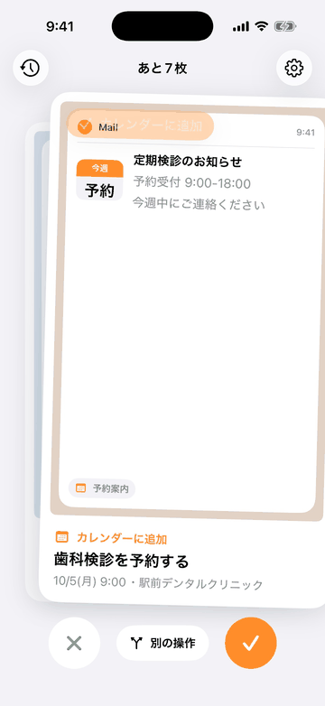
*カードを右に引っぱると、「✓ カレンダーに追加」のスタンプが濃くなります。離すとカードが飛んでいき、純正カレンダーに登録されます。最後に、下に「カレンダーに追加しました／取り消す」のトーストが出ます。*

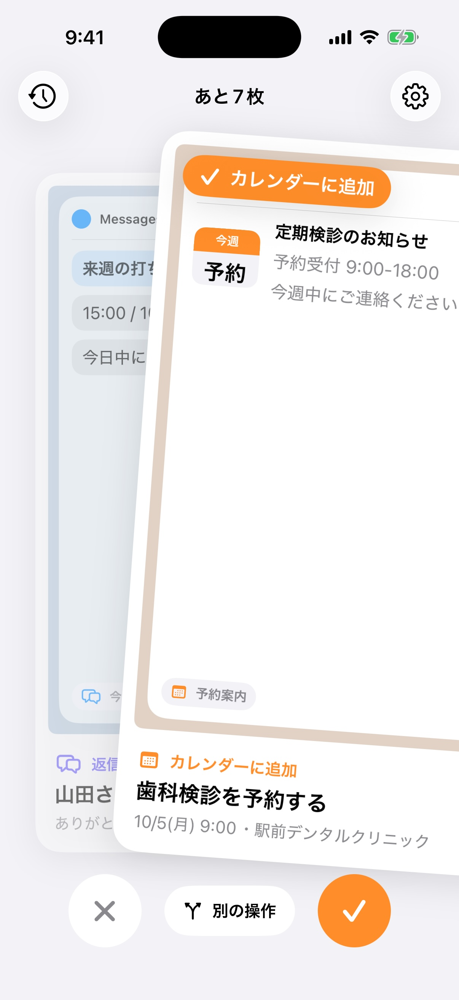
*スワイプの途中です。何をするのかが、指を離す前にスタンプで分かります。後ろには、次のカードが少し見えています。*

### 登録後の「取り消す」トースト

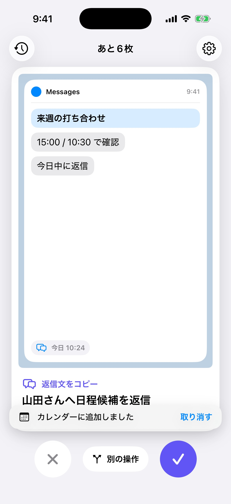
*登録すると、画面の下に「カレンダーに追加しました」と［取り消す］が5秒間表示されます。間違えても、ここですぐに戻せます。*

### 純正アプリには、こう入る

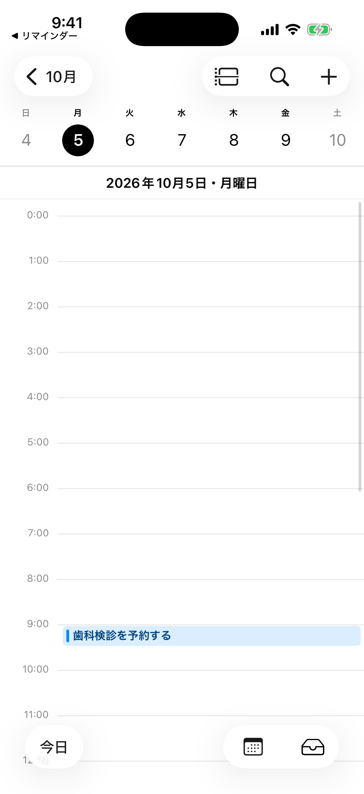
*純正カレンダーアプリで10月5日を開いたところです。9:00に「歯科検診を予約する」が入っています。*

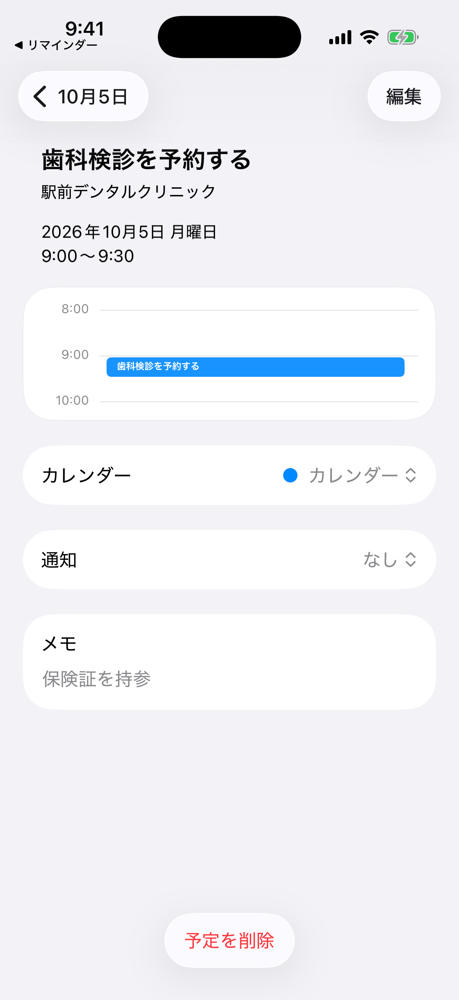
*純正カレンダーアプリの画面です。タイトル・場所・日時・メモ（保険証を持参）まで入っています。予定の時刻はGeminiが抜き出したもので、どの行動にするかを決めたのがJevの確率です。*

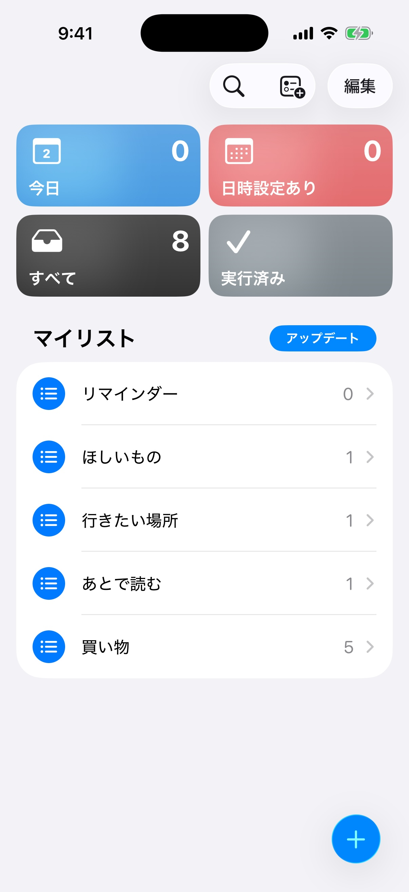
*純正リマインダーアプリには、Atodeが「ほしいもの」「行きたい場所」「あとで読む」「買い物」のリストを作り、そこに登録します。*

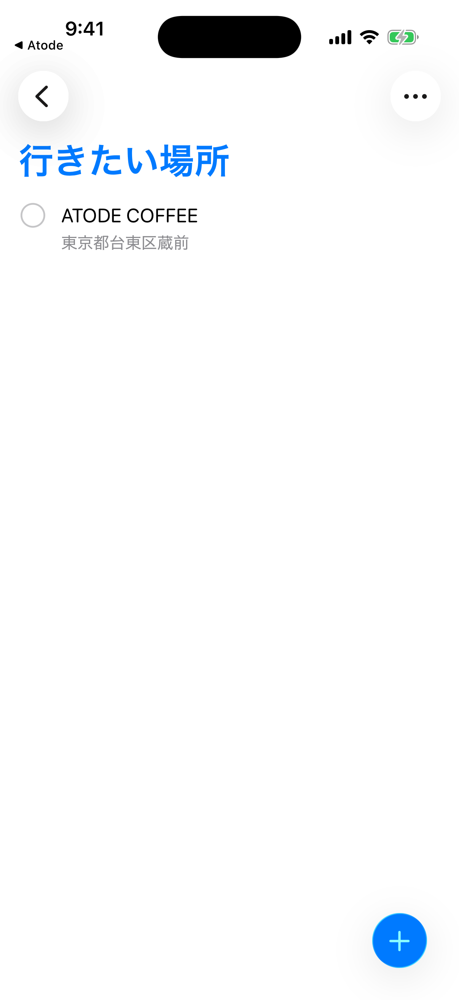
*「行きたい場所」のリストの中身です。お店の名前と住所が入っています（デモ用の架空の店名です）。*

### 違うときは「別の操作」

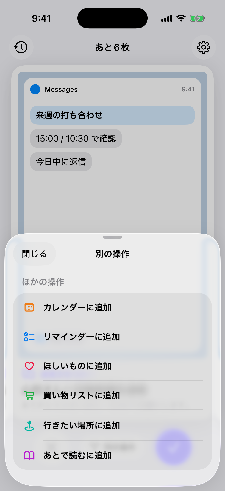
*「別の操作」を押すと、ほかの行動の一覧が出ます。選ぶとすぐに実行し、予定の日時など足りない情報があるときだけ、短い入力画面を出します。*

### あとから直す・取り消す（履歴）

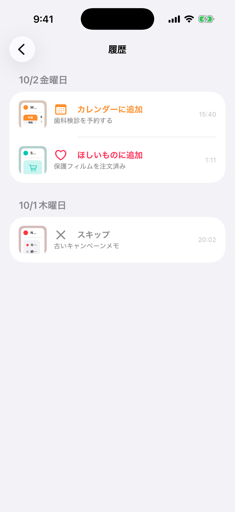
*振り分けた結果は、日付ごとに履歴に並びます。「カレンダーに追加：歯科検診を予約する」が、いま登録したものです。*

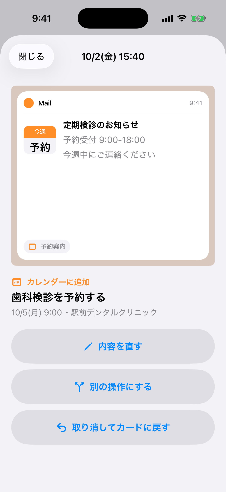
*履歴の行を押すと詳細が開きます。［内容を直す］［別の操作にする］［取り消してカードに戻す］の3つから選べます。*

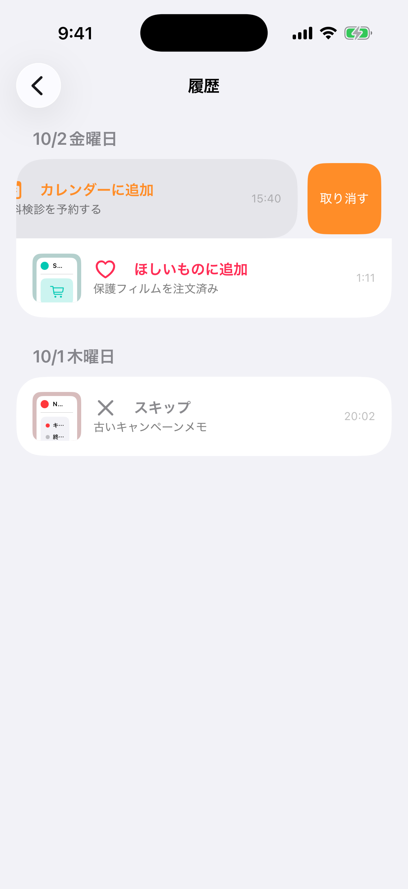
*行を左にスワイプしても［取り消す］が出ます。*

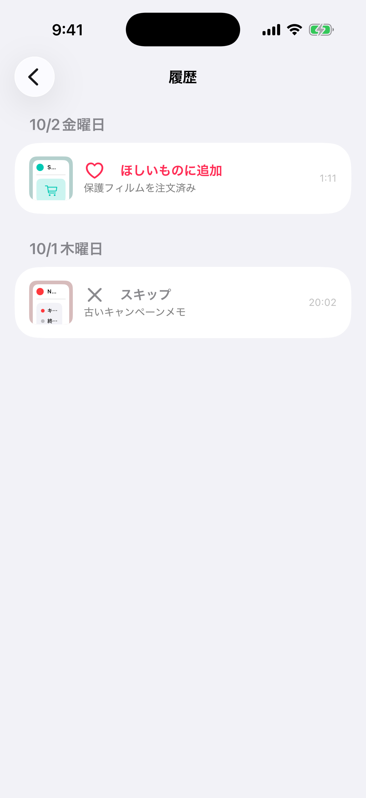
*取り消すと、履歴から消え、「取り消しました」と表示されます。このとき、純正カレンダーに作った予定も削除されます。カードは振り分け画面に戻ります。*

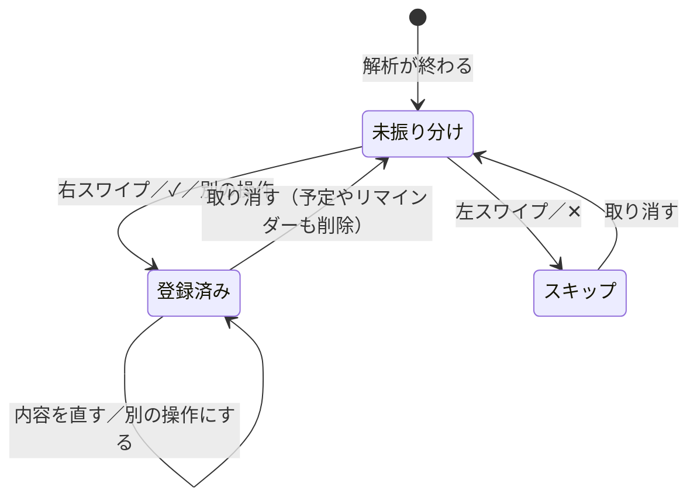
```mermaid
stateDiagram-v2
  [*] --> 未振り分け: 解析が終わる
  未振り分け --> 登録済み: 右スワイプ／✓／別の操作
  未振り分け --> スキップ: 左スワイプ／✕
  登録済み --> 未振り分け: 取り消す（予定やリマインダーも削除）
  スキップ --> 未振り分け: 取り消す
  登録済み --> 登録済み: 内容を直す／別の操作にする
```

---

## 背面タップと共有シートからのポップアップ

Atodeは、アプリを開かなくても使えます。2つの入り口があります。

### 背面タップ（ショートカット）

iPhoneには、**背面タップ**という機能があります。iPhoneの背中を2回または3回トントンと叩くと、決めておいた動作をします。ここに「スクショを撮って、Atodeで振り分ける」ショートカットを割り当てると、スクショを撮った直後に提案のポップアップが出ます。

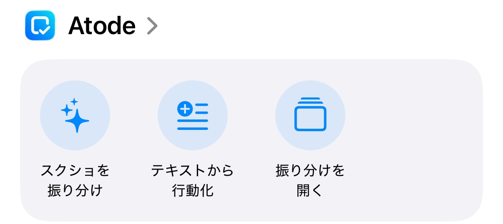
*純正のショートカットアプリに、Atodeのアクション「スクショを振り分け」「テキストから行動化」「振り分けを開く」が並びます。*

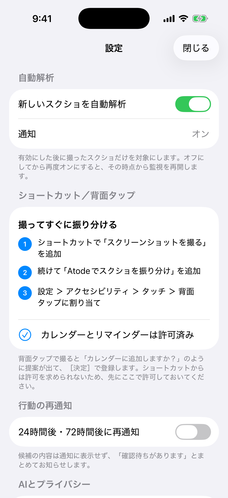
*Atodeの設定画面です。背面タップの設定手順が3ステップで書かれています。「カレンダーとリマインダーは許可済み」の行もあります。ショートカットはバックグラウンドで動くため、その場では許可を求められません。そのため、先にここで許可しておきます。*

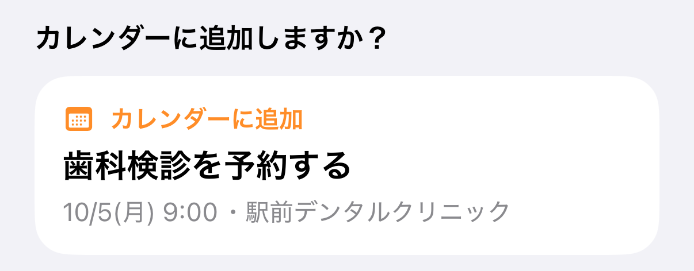
*背面タップの後に出るポップアップの中身です。「カレンダーに追加しますか？」の下に提案が表示され、実機ではこの下に［決定］［あとで］のボタンが並びます。*

:::message
**このキャプチャについて**：シミュレーターでは背面タップを再現できず、ショートカットアプリからもこのアクションを実行できませんでした。そのため、ポップアップに差し込まれる表示部品（`ProposalSnippetView`）を、デバッグ用の画面で表示して撮影しています。実機では、この中身がiOSの確認ダイアログの中に表示されます。
:::

ポップアップは、App Intents の `requestConfirmation` で出しています。

```swift:AtodeApp/App/AnalyzeScreenshotIntent.swift
        let actionName = ConfirmationActionName.custom(
            acceptLabel: "決定",
            acceptAlternatives: ["はい", "OK"],
            denyLabel: "あとで",
            denyAlternatives: ["いいえ"]
        )
        if #available(iOS 18.0, *) {
            try await requestConfirmation(actionName: actionName, dialog: dialog) { snippet }
        } else {
            try await requestConfirmation(
                result: .result(dialog: dialog) { snippet },
                confirmationActionName: actionName
            )
        }
```

- `ConfirmationActionName.custom`：ボタンの文字を「決定／あとで」にします。Siriで声で答えるときのために、「はい」「OK」「いいえ」も受け付けます。
- `#available(iOS 18.0, *)`：iOS 18以降と iOS 17 では、使える関数が違うため、分けて呼んでいます。
- 「あとで」を選ぶと、この関数が例外を投げます。Atodeはそれを受け止めて、「Atodeに残しました」と返し、カードをアプリに残します。

ポップアップを出す前に、**出してよいかどうか**を判定する関数もあります。

```swift:AtodeApp/Data/QuickTriagePlanner.swift
        guard isComplete else {
            return .needsInput(message: kind == .calendar
                ? "日時を読み取れなかったので、Atodeを開いて日時を選んでください。"
                : "内容が足りないため、Atodeを開いて振り分けてください。")
        }
```

- 提案に必要な情報が足りないとき（日時のない予定など）は、ポップアップを出さずにメッセージだけを返します。
- 続く処理では、カレンダーやリマインダーの許可がないときも、同じようにポップアップを出しません。

### 共有シート

写真アプリやSafariの［共有］からAtodeを選ぶと、その場で解析して提案を出します。

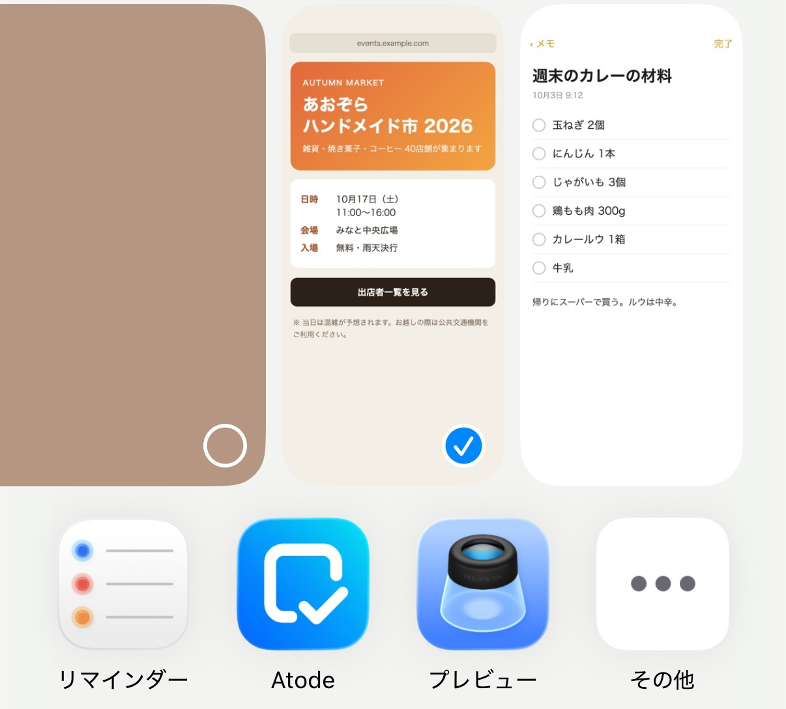
*写真アプリで画像を選び、［共有］を押したところです。アプリの並びに「Atode」があります。*

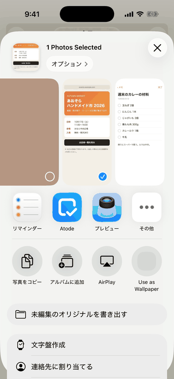
*Atodeを選ぶと「スクショを読み取っています」と表示され、数秒で「カレンダーに追加しますか？」の提案が出ます。［あとで］を押すと「Atodeに残しました」と出て閉じます。*

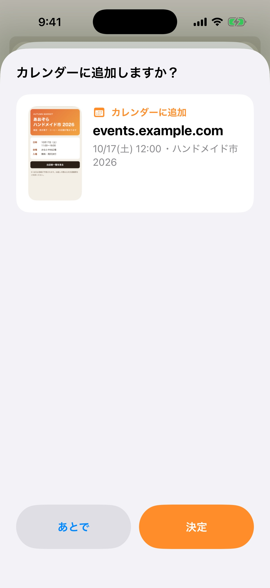
*共有シートのポップアップです。左に元の画像のサムネイル、右に提案、下に［あとで］［決定］があります。（シミュレーターで撮ったため、端末内の簡易解析の結果です。タイトルがURLになっているのはそのためです。）*

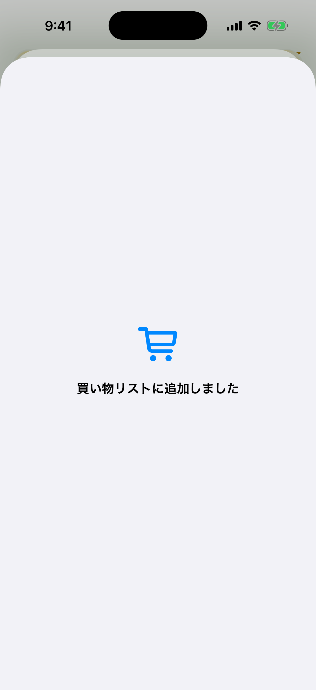
*買い物メモを［決定］したところです。「買い物リストに追加しました」と出て、純正リマインダーに登録されます。*

:::details 深掘り：共有拡張からサーバーのAIを呼ぶための工夫
共有シートの画面は、**共有拡張**（Share Extension）という、アプリとは別のプログラムで動いています。ここからサーバーを呼ぶには、2つの壁がありました。

1. **ログイン**：共有拡張は、アプリのログイン情報（キーチェーン）を読めません。そこで、共有拡張は自分で匿名ログインします。そのぶん、1日の上限は共有拡張のユーザーIDで別に数えられます。
2. **App Check**：共有拡張では App Attest（後述）が使えません。そこで、アプリが起動時とフォアグラウンドに戻ったときに、最後に取ったトークンを有効期限付きで App Group（アプリと拡張が共有できる保存場所）に置きます。共有拡張はそれを使います。有効なトークンがなければ、拒否されると分かっている通信は送らず、端末内で解析します。

App Attest のトークンの有効期間は、既定では1時間です。アプリを最後に開いてから1時間を過ぎると、共有シートでは端末内の解析になります。
:::

---

## 本番での運用

### ログで確かめる

Jevを呼ぶたびに、応答時間（`latencyMs`）、モデルの版、入力のトークン数をログに残しています。

```ts:functions/src/jevClient.ts
    logger.info("Jev judgement completed.", {
      model: decision?.model,
      latencyMs: Date.now() - startedAt,
      inputTokens: asRecord(asRecord(body).usage).input_tokens,
    });
```

**トークン**とは、AIが文章を数えるときの単位です（数え方はモデルごとに違います）。

本番のログは、`gcloud` コマンドで次のように読めます。

```bash
gcloud logging read 'jsonPayload.message="Jev judgement completed."' \
  --project <PROJECT_ID> --freshness=30d \
  --format='value(timestamp,jsonPayload.message,jsonPayload.latencyMs,jsonPayload.model,jsonPayload.inputTokens)'
```

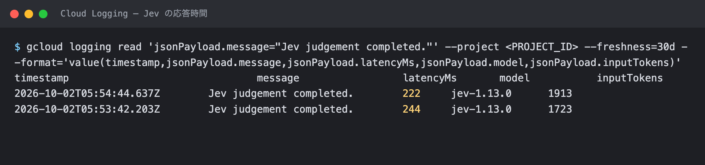
*本番のログを読んだ結果です（コマンドの出力を、読みやすいように整形して画像にしました。プロジェクトIDは伏せています）。2件とも `jev-1.13.0` で、応答時間は222msと244msでした。*

### 応答時間

| 日時（UTC） | Jevの応答時間 | 入力トークン | 関数全体の応答時間 |
| --- | --- | --- | --- |
| 2026-10-02 05:53 | 244ms | 1,723 | 3.24秒 |
| 2026-10-02 05:54 | 222ms | 1,913 | 2.58秒 |

関数全体の時間は、Cloud Functions のリクエストログから取りました。Jevの判定は、全体の1割未満の時間で終わっています。GeminiとJevを並列にしているので、**Jevを入れても、ユーザーの待ち時間は変わりません**。

:::message alert
記録はまだ2件だけです。本番でJevを有効にした直後の数字なので、傾向として見てください。件数が増えたら、あらためて集計する予定です。
:::

### コストと不正利用を防ぐ

AIのAPIは、呼んだ回数や量に応じてお金がかかります。誰でも自由にサーバーを呼べる状態だと、悪意のある人に大量に呼ばれて、高額の請求が来るおそれがあります。Atodeでは、3つの守りを重ねています。

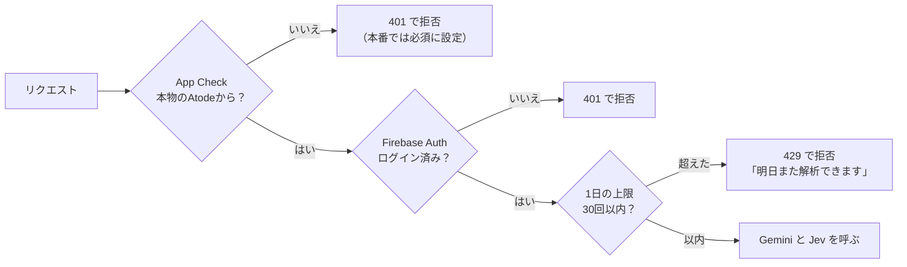
```mermaid
flowchart LR
  R["リクエスト"] --> AC{"App Check<br/>本物のAtodeから？"}
  AC -->|いいえ| X1["401 で拒否<br/>（本番では必須に設定）"]
  AC -->|はい| AU{"Firebase Auth<br/>ログイン済み？"}
  AU -->|いいえ| X2["401 で拒否"]
  AU -->|はい| Q{"1日の上限<br/>30回以内？"}
  Q -->|超えた| X3["429 で拒否<br/>「明日また解析できます」"]
  Q -->|以内| OK["Gemini と Jev を呼ぶ"]
```

**1. App Check と App Attest：本物のアプリからの通信だけを通す**

- **App Check** は、Firebaseの仕組みです。「このリクエストは、本物のAtodeアプリから来たものか」を確かめます。たとえるなら、ライブ会場の入口でリストバンドを確認するスタッフです。
- **App Attest** は、Appleが用意している証明の仕組みです。iPhoneの中の安全な領域で、「改造されていない本物のアプリです」という証明書（トークン）を作ります。App Check は、この証明書を確認します。

サーバーでは、リクエストのヘッダーにある App Check のトークンを確認し、必須の設定なら、なければ401で拒否します。

**2. Firebase Auth：ログインしているユーザーだけを通す**

Atodeは匿名ログインを使っています。ユーザーにメールアドレスなどを入力させず、端末ごとに目に見えないIDを発行する仕組みです。このIDで、誰が何回使ったかを数えます。

**3. 1日の上限：ユーザーごとに1日30回まで**

```ts:functions/src/index.ts
const dailyAnalysisLimit = defineInt("ATODE_DAILY_ANALYSIS_LIMIT", {
  default: 30,
  description: "Maximum remote AI analyses per authenticated user per Japan day. Use 0 to disable.",
});
```

- 日本時間の1日ごとに、ユーザーあたり30回までです。
- 回数は Firestore（Firebaseのデータベース）に、**トランザクション**で記録します。トランザクションとは、「読む・数える・書く」を一続きの操作として、途中で割り込まれないようにする仕組みです。同時に2回呼ばれても、数え間違えません。
- 上限を超えると、429で「本日のAI解析上限（30回）に達しました。明日また解析できます。」と返します。

:::message
**Jevを入れても、上限の数え方は変わりません。** 1回の解析で、GeminiとJevの両方を呼びますが、数えるのは1回です。なお、アプリ側には別に「月の解析枠」（無料プランは月20枚、Proは月300枚）があります。
:::

---

## ハマった点と、その解決

### 1. Jevは画像を受け取れず、文章も作れない

最初は「Geminiを丸ごとJevに置き換えられないか」と考えました。しかし、Jevの入力はテキストだけで、出力も判定だけです。タイトルや要約、返信文の下書きは作れません。

**解決**：「Geminiが書く、Jevが判定する」という役割分担にしました。Jevには、端末で読み取ったOCRの文字を渡します。

### 2. `score` の段階が0始まりか1始まりか分からない

`score` の値は、段階の番号を基準にした数字です。番号が0から始まるか1から始まるかで、同じ「2」でも意味が変わります（0始まりなら最高の段階、1始まりなら真ん中）。

**解決**：応答の `legend` から最小と最大を読み取り、割合に直してから段階を選ぶようにしました。本物のAPIで確かめると0始まりでしたが、1始まりのテストも残しています。

### 3. シークレットを宣言すると、登録前はデプロイできない

関数の設定で `secrets: [geminiApiKey, jevApiKey]` と宣言すると、その関数をデプロイする前に、シークレットを登録しておく必要があります。Jevのキーをまだ取得していない段階でも、Geminiの修正などで関数をデプロイしたいことがあります。

**解決**：キーがない間は、仮の値として `local-dev-disabled` を登録できるようにしました。この値のときは、コードが「キーなし」として扱い、Jevを呼びません。

### 4. 422の原因が分からない

質問の形を間違えると、Jevは **422**（リクエストの中身が不正）を返します。ステータスだけをログに残していると、どこが悪いのか分かりません。

**解決**：422のときだけ、エラーの本文を300文字までログに残すようにしました。それ以外のエラーでは、本文を残しません。

### 5. 共有拡張では App Attest が使えない

共有シートから解析すると、App Check で拒否されてしまいます。

**解決**：アプリが最後に取ったトークンを、有効期限付きで共有拡張に渡すようにしました（上の深掘りを参照）。有効なトークンがなければ、通信せずに端末内で解析します。

### 6. 背面タップからは、カレンダーなどの許可を求められない

ショートカットはバックグラウンドで動くため、「カレンダーへのアクセスを許可しますか？」の画面を出せません。許可がないまま実行すると、登録に失敗します。

**解決**：ポップアップを出す前に、許可と情報の不足を確かめるようにしました（`QuickTriagePlanner`）。許可がないときは、「Atodeの設定から許可してください」と伝え、スクショはカードとしてアプリに残します。設定画面には、先に許可を済ませるボタンを置きました。

### 7. 再解析すると、スキップした候補が復活する

UIを作り直す中で見つけた不具合です。再解析のときに候補を作り直していたため、ユーザーが一度スキップした候補が、また出てきてしまいました。

**解決**：スキップした（却下した）候補は、再解析でも消さずに残し、同じ候補を復活させないようにしました。あわせて、どの種類も、完了したときの状態を「実行済み」にそろえました（これまでは、種類によって「確認済み」で止まるものがありました）。

---

## 自分のアプリにJevを組み込むときのチェックリスト

:::message
エンジニアの方向けに、この記事の内容をチェックリストにまとめました。
:::

**質問の設計**

- [ ] LLMに任せる仕事（文章、抽出）と、Jevに任せる仕事（判定）を分けた
- [ ] 複数が同時に当てはまるものは `choice` ではなく、項目ごとの `noul` にした
- [ ] `choice` の最後に「どれでもない」の選択肢を置いた
- [ ] `choice` の選択肢を255個以内に打ち切っている
- [ ] `criteria` に、それぞれの答えの意味を言葉で書いた
- [ ] 日付の判断が要るなら、`state` に今日の日付とタイムゾーンを入れた
- [ ] 判断の材料が少なすぎるときは呼ばない（Atodeは12文字未満）

**通信と失敗**

- [ ] APIキーはシークレットに置き、コードやリポジトリに書いていない
- [ ] タイムアウトを設定した（Atodeは5秒）
- [ ] 失敗はすべて `null` などの「判定なし」にして、例外を外に投げない
- [ ] 422のときは原因が分かるログを残し、ほかのエラーでは本文を残さない
- [ ] 応答の値を必ず検証している（型、0〜1の範囲、送った選択肢に含まれるか）
- [ ] `score` は `legend` を読んで段階に変換している

**合わせ方と運用**

- [ ] LLMとJevを並列に呼び、Jevの待ち時間を隠している
- [ ] しきい値を定数として1か所にまとめた
- [ ] 「消す」操作のしきい値は低め（よほど自信があるときだけ消す）にした
- [ ] レスポンスの形を変えず、クライアントを更新せずに切り替えられる
- [ ] 機能フラグで、既定はOFFにしてある
- [ ] 応答時間・モデルの版・トークン数をログに残している
- [ ] 外部APIを `fetch` の差し替えでテストしている（成功・429・タイムアウト・不正なJSON）

---

## 今後やりたいこと

- **しきい値の見直し**：ユーザーが「別の操作」を選んだ割合や、取り消した割合を見て、しきい値を調整します。
- **ログの件数を増やして集計**：応答時間の分布や、どの行動が除外されやすいかをまとめます。
- **「別の操作」の並び順にもJevの確率を使う**：今も確信度の順に並んでいますが、Jevの確率をもっと前面に出す見せ方を考えています。
- **端末内の解析の改善**：この記事の撮影で、サーバーのAIが使えないときの解析の弱さ（タイトルがURLになる、品目が抜けるなど）がはっきり見えました。

---

## 用語集

| 用語 | 意味（たとえ話） |
| --- | --- |
| API | プログラム同士が話すための窓口。お店の注文カウンターのようなもの |
| LLM（大規模言語モデル） | 大量の文章で学習した、文章を読み書きするAI。ChatGPTやGeminiなど |
| Jev（System One） | TypeSafe社の判定用AI。選択・段階・はい／いいえの決まった形で答え、確率を返す |
| choice / score / noul | Jevの質問の種類。順に「選択肢から選ぶ」「段階で評価する」「はい／いいえ」 |
| 確率・確信度（confidence） | どれくらいありそうか、どれくらい自信があるかを0〜1で表した数字 |
| しきい値 | 「この数値以上なら採用する」という線。合格ラインのようなもの |
| OCR | 画像の中の文字を読み取ってテキストにする技術 |
| JSON | プログラムが読みやすい、データを書くための決まった書式 |
| スキーマ | 「この項目は数字、この項目は文字」といった、データの形の決まり |
| HTTPのステータス | 通信の結果を表す番号。200番台は成功、400・500番台は失敗 |
| 例外 | エラーが起きたことを知らせる仕組み。`throw` で投げ、`catch` で受け止める |
| Bearer認証 | APIキーを見せて通してもらう認証方式。会員証を見せて入館するイメージ |
| Cloud Functions | 呼ばれたときだけ動くサーバーのプログラム。呼び鈴を押されたときだけ出てくる受付係 |
| タイムアウト | 決めた時間までに返事がなければ、待つのをやめる決まり |
| 並列実行 | 複数の処理を同時に進めること。料理でお湯を沸かしながら野菜を切るようなもの |
| Promise | 「あとで結果が届く箱」。`await` で中身を取り出す |
| 機能フラグ | 機能の電源スイッチ。コードはそのままで、ONとOFFを切り替えられる |
| シークレット | APIキーなどの秘密の値を安全に保管する場所 |
| App Check | 本物のアプリからの通信かを確かめるFirebaseの仕組み。入口のリストバンド確認 |
| App Attest | iPhoneが「改造されていない本物のアプリ」だと証明するAppleの仕組み |
| トークン（AIの） | AIが文章を数える単位 |
| トランザクション | 複数の読み書きを、割り込まれない一続きの操作として行う仕組み |
| 共有拡張（Share Extension） | 共有シートの中で動く、アプリとは別の小さなプログラム |
| 背面タップ | iPhoneの背中を2回・3回叩くと、決めた動作をするiOSの機能 |
| フォールバック | 本命が使えないときに切り替える、代わりの手段 |

---

## Atodeの紹介

ここまで読んでいただき、ありがとうございました。最後に、この記事の主役のアプリを紹介させてください。

**Atode** は、「スクショを撮ったまま、忘れてしまう」をなくすためのアプリです。撮ったスクショをAIが読み取り、次にやることを提案します。合っていれば、右にスワイプするだけです。


### 使い方の例

**1. イベントの告知 → カレンダーへ**

SNSで見つけたイベントの告知をスクショします。Atodeが日時と場所を読み取り、「カレンダーに追加しますか？」と提案します。右にスワイプすれば、純正カレンダーに予定が入ります。


**2. レシピの材料 → 買い物リストへ**

レシピや買い物メモをスクショします。Atodeが品目を読み取り、純正リマインダーの「買い物」リストに、品目ごとに登録します。スーパーでチェックを付けながら買い物できます。

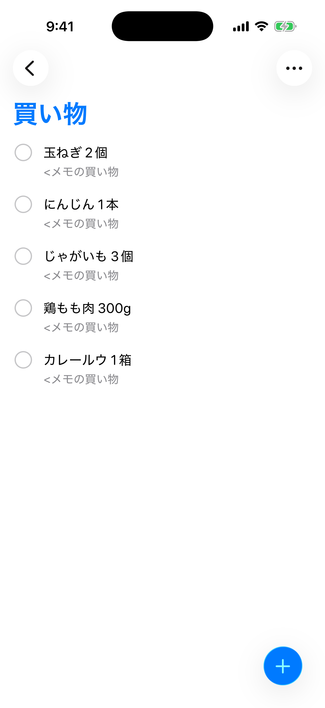

**3. 気になるお店 → 行きたい場所へ**

地図やSNSで見つけたお店をスクショします。「行きたい場所」のリストに、店名と住所が入ります。週末の予定を立てるときに見返せます。


### こんな人におすすめです

- スクショがたまる一方で、見返していない
- 予定やタスクは、Apple純正のカレンダーとリマインダーで管理したい
- 背面タップや共有シートで、アプリを開かずにさっと片付けたい

間違えても、履歴からいつでも取り消せます。まずは、写真アプリにたまっているスクショを1枚、Atodeに送ってみてください。

👉 **[Atode - スクショをAIで自動整理（App Store）](https://apps.apple.com/jp/app/atode-%E3%82%B9%E3%82%AF%E3%82%B7%E3%83%A7%E3%82%92ai%E3%81%A7%E8%87%AA%E5%8B%95%E6%95%B4%E7%90%86/id6778453895)**

基本無料で使えます（AI解析は無料プランで月20枚まで。Atode Proなら月300枚まで）。
