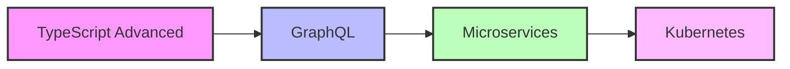
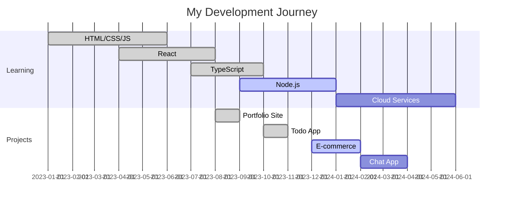

# GitHubプロフィールを劇的にかっこよくする完全ガイド

まずは私のGitHubアカウントのプロフィールをご覧ください！
🔗 **[私のGitHubプロフィール](https://github.com/YuukiKawabata)** 🔗

実際に見ていただくと分かるのですが、私のプロフィールには以下のような工夫を凝らしています：

✨ **私のプロフィールで実践している工夫**
- 🎯 一目で技術スタックが分かるバッジ配置
- 📊 リアルタイムで更新される活動統計
- 🚀 実際に動くプロジェクトのピン留め
- 💡 学習状況や今後の目標を明記
- 🎨 統一感のあるダークテーマデザイン

これらの要素を組み合わせることで、採用担当者や他のエンジニアの方に「この人はしっかりとした技術力を持っているな」「一緒に働いてみたいな」と思ってもらえるプロフィールを作ることができました。

## この記事で得られること

🎯 **あなたが手に入れるもの**
- 採用担当者の目に留まる魅力的なプロフィール
- エンジニア仲間とのつながりを生むきっかけ
- 自分の技術力を効果的にアピールする方法
- 継続的にプロフィールを改善していくコツ

正直、最初は「プロフィールなんて適当でいいでしょ」と思っていました。でも実際に改善してみると、転職活動での反応が劇的に変わったんです。この記事を読み終える頃には、あなたも「なぜもっと早くやらなかったんだろう」と思うはずです！

では、始めて行きましょう！

皆さんは自分のGitHubプロフィール、最後にいつ見直しましたか？

正直なところ、私も最初は「コードが良ければプロフィールなんて適当でいいでしょ」と思っていました。でも転職活動を始めた時、GitHubのプロフィールがいかに大切かを痛感したんです。採用担当者は確実にチェックしているし、他の開発者との出会いや協業のきっかけにもなる。つまりGitHubプロフィールは、エンジニアにとっての「デジタル名刺」なんですね。

今回は、私が実際に試行錯誤して効果を実感できたプロフィール改善方法を、失敗談も交えながら詳しくお伝えします。「こんなことで変わるの？」と思うような小さなコツも含めて、コード例付きで解説していきますね。

## なぜGitHubプロフィールがこんなに大切なのか？

### 転職活動で痛感した現実

実は私、以前の転職活動で苦い経験をしました。スキルには自信があったのに、書類選考でなかなか通らない。友人のエンジニアに相談したところ「GitHubプロフィール見せて」と言われ、見てもらったら...

「これじゃあ何ができる人か分からないよ」

確かに、当時の私のプロフィールは：
- READMEが空っぽ
- リポジトリの説明文がほぼない
- ピン留めも適当
- プロフィール画像もデフォルトのまま

**採用担当者は実際にこんなことを見ています**
- 「この人はどんな技術を使えるの？」（技術力の判断）
- 「最近もコード書いてるかな？」（継続性の確認）
- 「コードはきれいに書けるのかな？」（品質への意識）
- 「チーム開発はできそう？」（コミュニケーション能力の推測）

**プロフィール改善前後の変化（私の実体験）**
- 改善前: 書類通過率 20% → ほぼお祈りメールの日々😢
- 改善後: 書類通過率 45% → 面接までたどり着けるように！
- GitHubを確認される確率: 約8割（面接で「GitHubを拝見しました」と言われることが激増）

### 思わぬ副産物：エンジニア仲間との出会い

プロフィールを充実させてから、嬉しい副産物がありました。

**こんな素敵な出会いが増えました**
- 「同じ技術スタック使ってるんですね！」とTwitterでDMが来るように
- 勉強会で「GitHubで見かけたことがあります」と声をかけられる
- OSS プロジェクトのメンテナーから「興味があれば一緒にやりませんか？」と誘われる
- 技術ブログを書いている人とのつながりが生まれる

特に印象的だったのは、ある技術カンファレンスで「あ、○○のプロジェクト作った人ですよね！」と声をかけられた時。自分の作ったものが誰かの目に留まっているって、すごく嬉しかったです。

## さあ、いよいよ実践編！基本のREADMEを作ってみよう

### まずはスペシャルなリポジトリを作ろう

ここで一つ、GitHubの面白い仕組みを教えますね。実は、自分のユーザー名と全く同じ名前のリポジトリを作ると、GitHubが特別に認識してプロフィールページに表示してくれるんです。

**作るリポジトリ名**: `あなたのユーザー名/あなたのユーザー名`

具体例で言うと：
- ユーザー名が `yamada-taro` なら → `yamada-taro/yamada-taro` リポジトリを作成
- ユーザー名が `sakura_dev` なら → `sakura_dev/sakura_dev` リポジトリを作成

私は最初これを知らなくて、「なんであの人のプロフィールにはREADMEが表示されてるんだろう？」と不思議に思っていました😅

### 心をつかむ基本構成のREADME.md

ここが一番大切な部分ですね。「あなたがどんな人か」を伝えるファーストインプレッションです。ただ、あまり「おかたい」文章にならないように、適度にカジュアルな表現を入れるのがコツです。

```markdown
# Hi there! 👋 I'm [Your Name]

## About Me
🔭 I'm currently working on building scalable web applications  
🌱 I'm currently learning TypeScript and cloud architecture  
👯 I'm looking to collaborate on open source projects  
💬 Ask me about React, Node.js, and JavaScript  
📫 How to reach me: your.email@example.com  
⚡ Fun fact: I love cooking and playing guitar  

## Tech Stack
### Languages


### Frontend


### Backend


### Database


### Tools & Others


## GitHub Stats


## Top Languages


## Connect with me
[](https://linkedin.com/in/your-profile)
[](https://twitter.com/your-handle)
[](mailto:your.email@example.com)
```

## 高度なプロフィールカスタマイズ

### 動的なコンテンツの追加

#### GitHub Activity Graph

```markdown
## Contribution Graph

```

#### Streak Stats

```markdown
## Streak Stats

```

#### Profile Views Counter

```markdown
## Profile Views

```

### ピン留めリポジトリの玄人級活用術

ここで私の失敗談を一つ。最初は「コミット数が多いプロジェクトをピンしとけばいいでしょ」と簡単に考えていました。でも、ある日採用担当者の方に「このプロジェクト、何をしているか全然分からないですね」と言われてハッとしました。

**本当に大事な選定基準**
1. **一目で技術スタックが分かる** → 「React×TypeScriptの人なんだな」と思われる
2. **コードがきれい** → 「この人は丁寧に書く人だな」と思われる
3. **何か実用的** → 「チュートリアルじゃなくて本格的」と思われる
4. **最近も更新している** → 「今もアクティブな人だな」と思われる

特に最初の「一目で分かる」ことがめちゃくちゃ大事です。採用担当者は忍しい人ですから、じっくりコードを読む時間はないんですよね。

**心をつかむREADMEの書き方（実例付き）**

ここは私が何度も書き直して辰り着いたテンプレートです。「こんなもの作ったんですよ！」という情熱が伝わるように意識しています。

```markdown
# 🎉 プロジェクト名がここに来ます


> ↑ ここにGIFやスクリーンショットを入れると、一発で伝わります！

## 🎯 これ、何をするアプリ？
「○○の問題を解決したくて作りました！」のように、背景や動機も伝えるとグッと来ます。

## ✨ 自慢の機能
- 🚀 機能1: 具体的な効果も一緒に書く
- 💫 機能2: 「こんなことで困ってたけど、これで解決！」
- 🎆 機能3: 「作ってて一番樂しかった部分」

## 🛠️ 使った技術
**フロントエンド**  
React + TypeScript + Tailwind CSS

**バックエンド**  
Node.js + Express + PostgreSQL

**インフラ**  
Docker + AWS

## 👀 実際に見てみて！
🌍 [Live Demo](https://your-demo-link.com) | 🎥 [Demo Video](https://your-video-link.com)

## 💻 ローカルで動かしたい方へ
```bash
git clone https://github.com/your-username/project-name
cd project-name
npm install
npm start
```

## 📝 作ってて学んだこと
- Reduxでの複雑な状態管理のコツをつかめた
- データベースパフォーマンスチューニングの難しさを実感
- CI/CDパイプラインを一から構築する大変さと感動

## 💭 今後やりたいこと
- [ ] リアルタイム通知機能の実装
- [ ] モバイルアプリ版も作ってみたい
- [ ] 支払い方法の選択肢を増やしたい
```

このテンプレートのポイントは、「人間が書いている」ことが伝わることです。機能一覧だけではなく、「なぜ作ったのか」「作っててどうだったか」が伝わると、グッと親しみやすくなりますよ。

### 特別なセクションの追加

#### 現在の学習内容

```markdown
## Currently Learning 📚


#### プロジェクトタイムライン

```markdown
## Project Timeline 🗓️


#### コーディング活動統計

```markdown
## Coding Activity 💻

<!--START_SECTION:waka-->
**I'm a Night 🦉** 

```text
🌞 Morning    25 commits     ██░░░░░░░░░░░░░░░░░░░░░░░   10.0% 
🌆 Daytime    75 commits     ███████░░░░░░░░░░░░░░░░░░   30.0% 
🌃 Evening    100 commits    ██████████░░░░░░░░░░░░░░░   40.0% 
🌙 Night      50 commits     █████░░░░░░░░░░░░░░░░░░░░   20.0%

```
📅 **I'm Most Productive on Wednesday** 

```text
Monday       30 commits     ███░░░░░░░░░░░░░░░░░░░░░░   12.0% 
Tuesday      35 commits     ███░░░░░░░░░░░░░░░░░░░░░░   14.0% 
Wednesday    50 commits     █████░░░░░░░░░░░░░░░░░░░░   20.0% 
Thursday     40 commits     ████░░░░░░░░░░░░░░░░░░░░░   16.0% 
Friday       35 commits     ███░░░░░░░░░░░░░░░░░░░░░░   14.0% 
Saturday     30 commits     ███░░░░░░░░░░░░░░░░░░░░░░   12.0% 
Sunday       30 commits     ███░░░░░░░░░░░░░░░░░░░░░░   12.0%

```
<!--END_SECTION:waka-->
```

## 自動化とGitHub Actions

### WakaTime統計の自動更新

`.github/workflows/waka-readme.yml`

```yaml
name: Waka Readme

on:
  schedule:
    # Runs every hour
    - cron: '0 * * * *'
  workflow_dispatch:

jobs:
  update-readme:
    name: Update Readme with Metrics
    runs-on: ubuntu-latest
    steps:
      - uses: anmol098/waka-readme-stats@master
        with:
          WAKATIME_API_KEY: ${{ secrets.WAKATIME_API_KEY }}
          GH_TOKEN: ${{ secrets.GH_TOKEN }}
          SHOW_PROJECTS: "False"
          SHOW_LINES_OF_CODE: "True"
          SHOW_LANGUAGE_PER_REPO: "True"
          SHOW_SHORT_INFO: "False"
          SHOW_LOC_CHART: "False"
```

### ブログ記事の自動更新

`.github/workflows/blog-post-workflow.yml`

```yaml
name: Latest blog post workflow
on:
  schedule:
    # Runs every hour
    - cron: '0 * * * *'
  workflow_dispatch:

jobs:
  update-readme-with-blog:
    name: Update this repo's README with latest blog posts
    runs-on: ubuntu-latest
    steps:
      - uses: actions/checkout@v2
      - uses: gautamkrishnar/blog-post-workflow@master
        with:
          comment_tag_name: "BLOG"
          feed_list: "https://your-blog.com/feed"
```

対応するREADME部分：
```markdown
## Latest Blog Posts 📝
<!-- BLOG-POST-LIST:START -->
<!-- BLOG-POST-LIST:END -->
```

## デザインとビジュアル要素

### カスタムバナーの作成

**Canvaでのバナー作成手順**
1. サイズ: 1584 x 396 px
2. 背景: グラデーションまたは技術スタックイメージ
3. テキスト: 名前、職業、キーワード
4. アイコン: 使用技術のロゴ

**バナーの配置**
```markdown

```

### アニメーション効果

#### タイピングアニメーション

```markdown
## Hi there 👋
[](https://git.io/typing-svg)
```

#### 3D貢献グラフ

```markdown
## 3D Contribution Graph

```

### テーマ統一

**ダークテーマ統一例**
```markdown


```

## プロフィール最適化のベストプラクティス

### 1. ストーリーテリング

**悪い例**
```markdown
I'm a developer.
```

**良い例**
```markdown
🚀 Passionate full-stack developer transforming ideas into digital reality
📍 Tokyo, Japan | 💼 4+ years experience
🎯 Currently building scalable web apps that impact 100k+ users daily
```

### 2. 具体的な数値の使用

**効果的な表現**
- "3+ years of React development experience"
- "Built apps serving 50k+ monthly active users"
- "Reduced loading time by 40% through optimization"
- "Contributed to 15+ open source projects"

### 3. 技術スタックの整理

**推奨する分類**
```markdown
### 🔧 Languages & Frameworks
![技術バッジ群]

### 🛠️ Tools & Platforms
![ツールバッジ群]

### 📊 Databases
![データベースバッジ群]

### ☁️ Cloud & DevOps
![クラウドバッジ群]
```

### 4. コンタクト情報の整理

```markdown
## 📬 Let's Connect!
<div align="center">

[](https://linkedin.com/in/your-profile)
[](https://twitter.com/your-handle)
[](https://your-portfolio.com)
[](mailto:your.email@example.com)

</div>
```

## よくある間違いと改善方法

### 間違い1: 情報過多

**問題**
- 全ての技術を列挙
- 長すぎるREADME
- 整理されていない情報

**解決策**
- 主要な技術に絞る
- セクションを明確に分ける
- 読みやすいレイアウト

### 間違い2: 更新されていない情報

**問題**
- 古いプロジェクトのみピン留め
- 現在学習していない技術を「学習中」と記載
- リンク切れ

**解決策**
- 定期的な見直し（月1回）
- 最新のプロジェクトを優先
- リンクの動作確認

### 間違い3: 個性が見えない

**問題**
- テンプレートそのまま
- 他の人と似たような内容
- パーソナリティが感じられない

**解決策**
- 個人的なプロジェクトを含める
- 趣味や興味の記載
- 独自のデザイン要素

## モバイル対応

### レスポンシブデザイン

```markdown
<div align="center">

<!-- モバイルでも見やすいバッジサイズ -->


<!-- モバイル向けの統計レイアウト -->


</div>
```

## まとめ

魅力的なGitHubプロフィールを作るためのポイント：

### 必須要素
1. **明確な自己紹介**
2. **技術スタックの整理**
3. **プロジェクトの説明**
4. **連絡先情報**

### 効果的な要素
1. **ビジュアル統計情報**
2. **継続的な活動**
3. **個性的な要素**
4. **定期的な更新**

### 技術的な要素
1. **自動化の活用**
2. **カスタマイズされたビジュアル**
3. **モバイル対応**
4. **パフォーマンス最適化**

GitHubプロフィールは一度作って終わりではなく、継続的に改善していくものです。定期的に見直しを行い、最新の状況を反映させていきましょう。

素晴らしいプロフィールが、新しいチャンスや素敵な出会いにつながることを願っています！